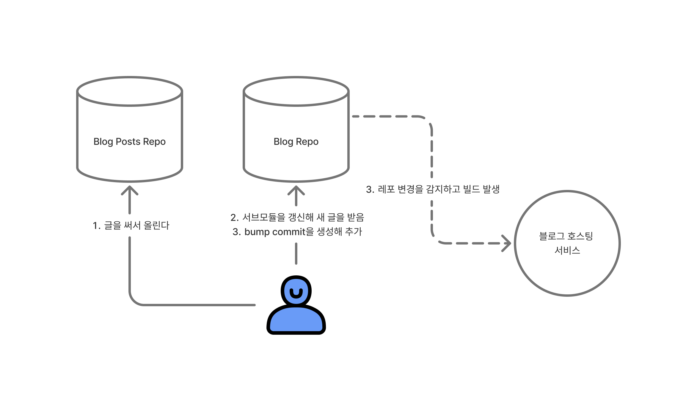
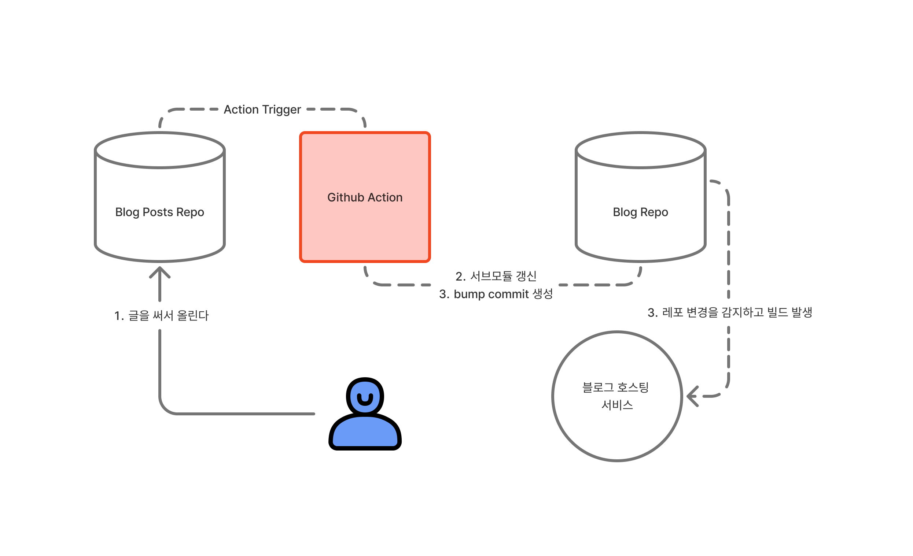

2025년 회고가 돌아왔다. 이번엔 상반기 회고와 하반기 회고를 분리하려고 한다. 이유는 작년 회고가 세 개로 너무 많아 1년 전체를 평가하기에는 연초의 기억이 흐릿해 정확한 평가가 어려웠기 때문이다.

## 무엇을 이루었는가?

### 블로그 글쓰기 경험 개선 - 글올리기 자동화

기존에 글을 쓰고 수동으로 올리던 방식을 자동화하여 글쓰기 경험을 개선했다. 방식은 단순하다.

<em>이전 호스팅 구조</em>

우선 나는 글을 모아놓는 포스트 레포와 블로그 레포를 분리해서 운영하고 있다. 블로그 레포는 포스트 레포를 서브모듈로 참조하고 있다.
따라서 기존엔 글을 써서 포스트 레포에 올리고, 블로그 레포에 가서 서브모듈을 패치한 뒤, bump commit을 밀어넣으면 블로그를 호스팅하는 서비스가 이를 감지해 블로그를 새로 빌드해 호스팅하는 식이었다.

이미 이전에 블로그를 만들고 실패했던 경험이 있기에 이 방식을 유지할 수 없다고 생각했다. 이런 불편함이 반복되면 흥미가 떨어지고 글쓰기가 스트레스가 된다.

<em>개선된 호스팅 구조</em>

그래서 Github Action을 사용해 글이 올라가면 블로그 레포의 서브 모듈을 갱신하고 bump commit을 밀어넣어 블로그 빌드가 자동으로 이루어지게 변경했다. 이를 구현하는 것은 오래 걸리지 않았다. 이런 내용은 내가 설계만 할 수 있다면 GPT가 쓱싹해서 처리해준다. (과거에도 그랬지만 이젠 더욱 설계 능력이 중요하다고 느낀다.)

처음엔 사소한 개선이라 여겼는데, 지금은 아주 만족스럽다. 시간으로 따지면 10초정도 아꼈겠지만 bump commit을 만들기 위해 블로그 레포에 들어가지 않아도 된다는 것 만으로도 10초 이상의 가치를 느낄 수 있었다.

이로써 올해 목표 중 하나인 글쓰기 경험 개선을 절반정도 이루었다. 앞으로는 옵시디언을 통해 글을 쓰고 올리는 것도 훨씬 쉽게 만들 수 있지 않을까 생각한다.

### 회사 디자인 시스템 진전

올해 가장 만족스러운 것 중 하나는 바로 회사의 디자인 시스템 개발이 조금씩 이뤄지고 있다는 점이다.

우리 회사는 Chakra 디자인 시스템을 도입해 사용하고 있는데, 다양한 이유로 기존 디자인 시스템을 밀어내고 내재화를 위해 천천히 움직이고 있다. 처음엔 한두 개 내재화하는 것으로 시작했는데, 어느새 10가지가 넘는 컴포넌트들이 갖춰졌다.

디자인 시스템을 교체해가는 과정은 생각보다 어려웠다. 디자인 시스템 교체는 달리는 기차의 바퀴를 바꾸는 일이었는데, 때문에 급진적으로 할 수 있는 것이 없었다. 전부 팀원들에게 공개하고 천천히 피드백을 받아가며 바꾸어야했고, 어떤 컴포넌트는 꽤 오래 시스템에 공존해야했다. 돌이켜보면 이 작업은 시맨틱 토큰이나 좋은 인터페이스 구상보다 꾸준히 개선해 나가는 것이 중요했던 것 같다.

하지만 아쉽게도 올해 계획중 하나였던 KRDS 개발은 이미 디자인시스템 개발 욕구가 충분히 충전되고 있기에 안녕...

그 외에도 디자인 시스템을 포함해 디자이너와의 협업 경험 개선을 위해 다양한 시도를 하고 있는데, 조금씩 진행되고 있는 것 같아 기분이 좋다. 특히 i18n 관리를 figma로 이전해 직관성을 높인 것이 만족스러운데, 이 작업은 아직 우여곡절 속에 있기에 축배를 들기 어렵다. 올해 말에는 어느정도 잘 자리잡았으면 좋겠다.

## 무엇이 아쉬웠는가?

### Ticketbell 종료

사이드 프로젝트로 진행하던 Ticketbell이 종료 되었다. 약 8개월 정도 지속되어 이루어진 프로젝트 같은데, 결국 그 한계를 맞으며 종료하게 되었다.

문제는 다음과 같았다.

1. Backend 개발자가 할 일이 없었다.
2. Frontend 개발은 할게 많은데, 내가 너무 바빠 진전을 이룰 수 없었다.

상반기에 회사에서 새로운 Big Feature 개발에 연속으로 들어가면서 사이드로 하는 것들이 점점 느려지고 내가 지쳐가고 있다는 것을 느낄 수 있었다. 결국 사이드 개발을 이어할 수 없었고, 여유가 없으니 프로젝트에 대한 열정도 같이 식은 것 같았다.

그래서 아쉽지만 개발을 이어갈 수 없었고, 다음에 더 좋은 프로젝트로 다시 만나기를 이야기하며 프로젝트를 종료했다.

그래도 사이드 프로젝트를 이렇게 오래 가져가본 것은 또 다른 기록 갱신이기에 다음번엔 더 잘할 수 있을 것이라 생각한다.

### 글쓰기

글쓰기를 거의 하지 못했다...! 원인은 일이 바빴던 것에 있다. 일/운동/잠 이 세 가지 만 빙글빙글 돈 것 같다. 이것도 막바지엔 운동을 살짝 내려놔야 했었다. 그러다보니 글감을 거의 찾지 못했다. (이렇게 쓰고 보니 변명 같기도 하다) 이런 시간이 지속되니 글 안쓰는 관성까지 붙으면서 더 글을 쓰기 어려워졌다.

물론 회사가 야근을 강요하는 악덕회사인 것은 아니다. 하던 일을 못내려놓는 습관과 바쁜 시즌이 겹치며 환상의 콜라보가 되어버렸다. 물론 너무 좋아하는 일(에디터 만들기)이기에 더 잘하고 싶은 마음에 놓지 못한 것도 있다.

하반기엔 정보성 글을 조금이라도 써보고 싶다. 흔히 엘리스의 토끼굴에 빠지지 말라고 말하는데, 나는 엘리스의 토끼굴 속에서 헤엄치는 것을 꽤나 즐기는 편이라 '와 이런 것도 있었구나?'하고 발견하는 것들이 있는데, 조금이라도 기록하고 공유하고 싶다. (최근 먹이감은 `font-palette`이다. )

> 엘리스의 토끼굴에 빠지지 말라
>
> 어떤 개념을 이해하기 위해 파고들수록 또다른 개념을 이해할 필요가 생겨서 처음 의도한 학습 방향과 점점 멀어지는 현상을 '이상한 나라의 앨리스'에 등장하는 토끼굴에 비유한 말

아자아자

## 동료 평가

상반기 하향 리뷰를 받았다. 그리고 이번엔 하향 리뷰에 더불어 GPT에게 '내가 한 모든 질문과 상호작용을 기반으로 나의 사고 패턴을 찾아줘'라고 질문을 했다. (요즘 유행인듯 하다?)

결과가 정말 재미있었는데, 하향 리뷰와 GPT 모두 내가 오픈 소스를 활용하기 보다 직접 만드는 경향이 있다는 점을 지적했다는 것이다. 곰곰이 생각해보니 나는 정말 그러한 경향이 있었다. 흔히 바퀴를 다시 발명하지 말라고 하는데, 실제로 나는 잘 맞는 바퀴를 찾는데 능숙하지 못하다. 그러다보니 직접 만드는 경향이 생겼는데, 남들이나 GPT가 봐도 내가 그런 사람인게 보이는구나 라고 생각이 들었다.

물론 이것은 나의 단점 중 하나다. 당연히 바퀴는 있는 것을 쓰는게 좋다. 그래서 앞으로는 가능하면 있는 것들을 잘 활용하는 연습을 해보려 한다.

그 외로 좋은 평가로는

1. 외부 요인에 의한 스트레스에 강하다.
2. 새로운 것을 빠르게 익히고 공유를 잘한다.

아쉬운 평가로는

1. 소통에서 맥락을 생략하고 말할 때가 있다. 상대방이 개발자가 아니라면 어려울 수 있다.
2. 큰 설계를 위해 사전에 더 많이 고민했으면 좋겠다.

아쉬운 평가들은 직접 체감하고 있다. 말을 하고 보니 '아 조금 더 쉽게 말해볼껄'이라는 생각이 드는 일이 종종 있었다. 그리고 큰 설계는 아직 덜 성숙해진 역량이라 생각하고 받아들이고 있다. 반대로 시니어 개발자들의 설계를 보면 우와! 하는 포인트들이 있다. 설계 능력을 어떻게 키울 수 있을지는 전략을 새워보면 좋을 것 같다.

GPT는 다음을 추천했다.

읽어볼 것들: 데이터 중심 애플리케이션 설계, 클린 아키텍처, 소프트웨어 아키텍처 101, GoF의 디자인 패턴
실천할 것들: 현재 시스템 그려보기, 작은 기능도 설계 문서 작성해보기, 리팩토링 주도하기(그 구조가 왜 문제인지 생각해보기)

## 하반기를 대비하며

하반기엔 기대되는 것들이 있다.

### Split Keyboard 구매 완료

드디어 Split Keyboard를 구매했다. 약 50만원 정도의 지출이 있었다. 전에 유튜브 쇼츠에서 봤는데 골반 틀어짐 및 비대칭은 결국 생활 습관이 문제라고 했다. 이 키보드가 모든 것을 고치는 만병통치약은 아니겠지만, 조금의 개선은 있지 않을까 기대하고 있다.

### 운전면허

드디어 미루고 미루던 운전면허 따기에 돌입했다. 비록 2종 보통이지만 하기 싫다고 차일피일 미루던 것에 드디어 종지부를 찍으려한다.
