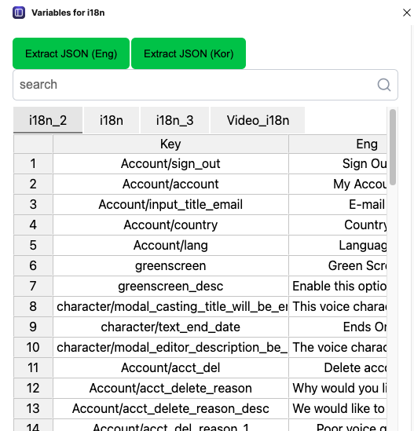
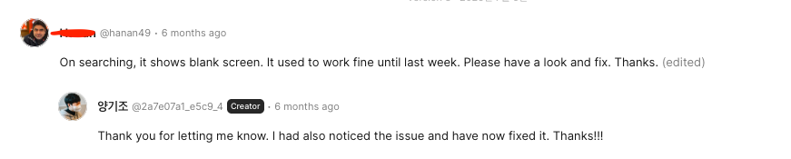

## 회사에서 수행한 것

### 첫 지표적 상승 경험

회사 제품의 인증/인가 프로세스를 단축시키는 개편작업을 했고, 이것이 나의 첫번째 유의미한 지표상승 작업이 되었다. 무려 3개월 정도 정체되어 있던 해외 유저 signup 지표가 30%정도 상승해 일일 회원가입 유저가 1,000명을 찍는 경험을 할 수 있었다. 

내가 주도하지도 않았고, 주어진 걸 잘 한게 다일 수 있지만 그래도 이 과정에서 소통하고 더 좋은 방법을 제안하는 과정이 결실을 이루어 달성한 업적이라 생각한다. 

### 동료평가

회사에서 개인은 여러 집단과 관계를 맺게 된다. 예를 들어 개발자-디자이너, 개발자-개발자, 개발자-회사 같은 관계가 있을 것이다. 이 관점에서 나는 어떤 동료였는지 되짚어 본다면

1. 디자이너에겐 무난한 개발자였을 것 같다.
	1. 디자인시스템을 챙기려는 시도는 2025년에도 꾸준히 진행됐다.
	2. 하지만 개인적으로 디자이너에게 좋은 영향을 줄 수 있는 시도는 많지 않았던 것 같다.
2. PM에겐 괜찮은 개발자였을 것 같다.
	1. 방치되어 있던 작은 테스크들을 챙겼다.
	2. 소통하는 과정에서 '왜'를 자주 물었고 더 좋은 제안을 하려고 노력했다.
3. 개발자에겐 좋은 개발자였을 것 같다.
	1. 라이브러리 버전 업데이트를 수행했다. 
	2. 디자인시스템을 포함해 좋은 코드와 효율적인 코드 작성을 위해 노력했다.
	3. 리팩토링도 틈틈이 챙겼다.
4. 회사에겐 무난한 개발자였을 것 같다.
	1. PM,디자이너와 소통하며 만들어낸 가치들이 있지만 주어진 것을 잘 수행한 것 정도이다.
	2. 내가 맡은 영역에서 그닥 큰 기여는 하지 못했다. 이는 매출 상승에 영향을 줬다고 보기 어렵다.
	3. 인증/인가 부분을 거진 전담하며 잘 챙겼다. 개선 작업을 통해 일부 지표 상승이 있었고 리소스를 줄인 부분도 있다.

동료 평가도 이와 비슷했다. 적당히 좋은 동료였지만 좀 더 잘했으면 하는 부분들이 있다.
- 도메인 영역의 이해도를 높여 비즈니스 차원에서 좀 더 기여했으면 하는 바람
- 설계 차원에서 개발자 역량을 높일 필요 있음
- 테스크 관리를 더 잘하고 싶은 바람

## 대외적으로 수행한 것

### Zed와 Slate.js에 contribute

zed는 rust로 작성된 IDE인데, Vim을 잘 지원해서 사용하고 있다. 근데 10월쯤에 갑자기 eslint가 잘 동작하지 않는 문제를 마주했는데, 아마 내가 설정을 잘못 건드려서 그랬을 것이다.

이걸 수정하는 과정에서 동료가 [json.schemastore.org가 deprecated된 것](https://github.com/microsoft/vscode/issues/254689)을 공유해줬는데, 덕분에 zed가 deprecated된 json.schemastore.org 도메인을 쓰고 있다는 사실을 알 수 있었고, 이게 에디터가 고장 난 이유이지 않을까 하는 마음에 [PR](https://github.com/zed-industries/zed/pull/42336)을 올리게 되었다. 

다음으로 slate.js도 우연히 FAQ를 읽다가 올해 공급망 공격으로 논란이 되었던 polyfill.io 주소가 적혀 있는 것을 보고 수정하는 [PR](https://github.com/ianstormtaylor/slate/pull/5996)을 올릴 수 있었다.

유의미한 코드 수정은 아니지만 내가 사용하는 것들에 작은 부분이나마 기여할 수 있었다는 점이 기뻤다.

## 사이드 프로젝트 총 결산

### [Variables for i18n](https://github.com/dev2820/variables-for-i18n)
피그마 플러그인: https://www.figma.com/community/plugin/1465032483656605623/variables-for-i18n

아차. 2025년 1월쯔음 개발한 피그마 플러그인인데, 찾아보니 2025년 상반기 회고에 언급을 하지 않았었다.

위 플러그인은 variables에 작성된 i18n을 쉽게 검색하고 수정할 수 있게 하는 플러그인이다. 다음의 특징이 있다.
- 처음으로 출시한 피그마 플러그인이다.
- 스프레드시트 형태의 UI를 적용해 피그마 내에서 variables로 작성된 i18n을 엑셀 다루듯 사용하는 경험을 주려 했다.
	- [Jsspreadsheet CE](https://bossanova.uk/jspreadsheet/)를 사용했다.
- vanilla extract를 사용했는데, 크게 이유가 있던 것은 아니고, 한 번 써봐야지 ㅎㅎ 라는 생각이었다.
	- 피그마 플러그인 환경에서 css파일을 직접 불러올 수 없었던 것도 영향이 있었다.
	- 일단 도입은 했는데...잘 쓰고 있는지는 모르겠다.

개인적으로 업무시에 쏠쏠히 쓰고 있다. 은근히 i18n을 검색할 일이 종종 있어서 쓰고있고, 쓰다보면 '아 이거 고쳐야겠다.'하고 느리게 한 번씩은 업데이트하게 되는 것 같다. 

사실 이 프로젝트에서 가장 기쁜 점은 코멘트가 달렸다는 점인데 

누군가 쓰고있고 업데이트 후에 흰 화면이 나온다는 버그 리포트를 받았다. 누가 쓰고 있을 거라고 생각 못했는데, 누군가 썼고, '아 뭐야 안 되네;;'하고 버리지 않고 코멘트로 안된다고 알려줬다는 점이 상당히 기쁘다. 

2026년에는 기회가 닿는다면 디자인 개편을 좀 해보고 싶다. 

### [Scrapper](https://github.com/dev2820/scrapper)

2025년 하반기에 새로 시작한 프로젝트. 이름은 Scrapper고 README도 텅 비어있다.
목적은 긱뉴스, 유튜브 등 '나중에 봐야지~' 했던 링크들을 스크랩해두는 것이다. 기존에 카카오톡 '나에게 보내기' 기능을 스크랩하는데 사용했어서 카카오톡의 UI를 많이 참고했다.

개발 과정에 다음의 특징이 있었다.
- React Native를 사용해 개발했고, AI에게 바이브코딩을 많이 시켰다.
	- 덕분에 내가 잘 모르는 네이티브의 설정이 필요한 기능들 대부분 구현할 수 있었다. (링크 공유하기 등)
- AI에게 디자인과 개발을 모두 맡긴 첫 프로젝트이다.
	- 디자인은 [Stitch](https://stitch.withgoogle.com/)를, 개발은 Claude Code를 사용했다. Stitch가 꽤 마음에 들었고 앞으로도 자주 사용할 것 같다.
- 안드로이드, iOS에 대한 기반지식 없이 진행하는 것은 쉽지 않았다. 바이브코딩을 시키다보면 어느샌가 구덩이에 빠져 허덕이고 있는데, 내가 지식이 없으니 같이 구덩이에서 허덕이는 상황이 발생했다. 어쩌면 개발자는 사라지지 않을 것이라는 것을 체감한 것일지도 모르겠다.

아직 개발중이며 출시 예정은 없다. 개인적으로 쓰려고 만든 앱이라 출시에 우선순위가 있지 않다. 하지만 2026년에 완성도를 높인다면 출시도 고려해볼 수 있을 것 같다. 다만 출시한다면 최대한 가볍게 만들어서 출시하지 않을까. 

### [Readme Editor](https://github.com/dev2820/readme-editor)

아직 이미지 없음

2024년에 잠정 중단했던 프로젝트를 2025년 막바지에 다시 시작했다. 이 때에 중단했던 이유는 흥미가 다 떨어져서였다. 내가 하는 대부분의 사이드 프로젝트들은 이런식으로 흥미를 잃기 전까지 달리다 버리는 경우가 많은데, 고질적인 문제인 것 같다.

그랬던 사이드 프로젝트들에 AI의 발전으로 다시 한 번 기회가 생겼다. 이제는 디자인도, 개발도 AI를 통해 훨씬 빠르고 쉽게 개발할 수 있다. 특히 AI의 강점은 zero to one의 비용을 몹시 낮춰준다는 점 같은데, 덕분에 대부분의 기술적 문제는 막힘없이 진행할 수 있게 되었다.

덕분에 이 프로젝트도 다시 진행할 수 있게 되었고, 이미 진행중이다. 이번 기회에 다음의 변화를 적용해 새로 시작해보려 한다.
- 기존 에디터 라이브러리를 blocknote에서 slate.js로 변경했다. 덕분에 훨씬 자유로운 에디터 개발이 가능해졌다. 당연히 AI의 도움을 받아 slate.js를 빠르게 잘 다룰 수 있게 되었다.
- AI가 잘할 수 있는 환경을 고려한 프로젝트로 개편했다. 말인 즉슨, 다음의 방식으로 개발을 해보려고 한다.
	- 스택은 최대한 대중적인 것을 고려했다. react, typescript, shadcn 등.
	- 추상화를 잘 해보기 위해 모노레포를 도입했다. 각 레포에는 적절한 README 또는 CLAUDE.md를 붙여 ai가 혼자 잘할 수 있게 해보려한다.
	- feature개발은 대부분 AI에게, 그리고 리팩토링을 내가 하는 방식으로 워크플로우를 수행해 보고자 한다. 이를 통해 개발 속도는 높이는 동시에 설계에 대한 공부를 좀 챙겨보려한다.
- 추가적으로 기획에 대한 AI를 찾아보고 붙여보려한다. 기획을 통해 판매할 수 있는 value를 찾아보는 것 까지 경험하는 것이 이 프로젝트의 최종 목표이다.

2026년에 완성을 목표로 하고 있다.

## 개발자로서 내년도 목표 및 방향성

### 더 중요한 것에 집중하기

작년까지의 성장 방향은 기초에 집중되어 있었다.
- 재활용 가능한 코드 작성하기 - 디자인 시스템 구축
- 접근성을 고려한 코드 작성

이제는 이런 것들을 충분히 하기도 했고, AI로 인해 그 비용이 많이 낮아진 것도 있다. 이제는 크게 집중하지 않아도 될 것 같다. 따라서 2026년에는 다음의 것들에 집중해보려한다.

- 설계 공부
	- 리팩토링 잘하기
		- 사이드프로젝트에서 리팩토링 많이 하기
	- TDD, 디자인 패턴, 오브젝트 등 설계 관점의 공부

- AI는 잘 쓰는 사람 잘 따라가기
	- 이미 잘 하고있는 사람들 잘 벤치마킹하기
	- 나만의 프로세스 갖추기

특히 AI는 솔직히 너무 빨리 바뀌고 있어 내가 발굴하기엔 좀 지치는 감이 있다. 그래서 패스트 팔로워 전략으로 따라가기에 집중해보려고한다. 여전히 더 많이 써볼 필요는 있다.
