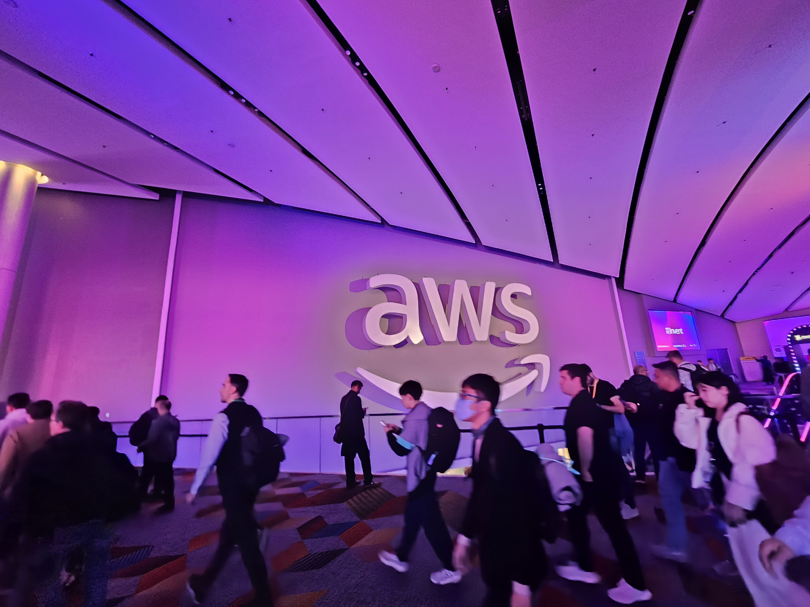
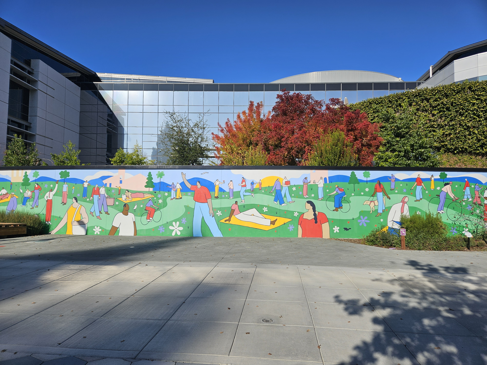
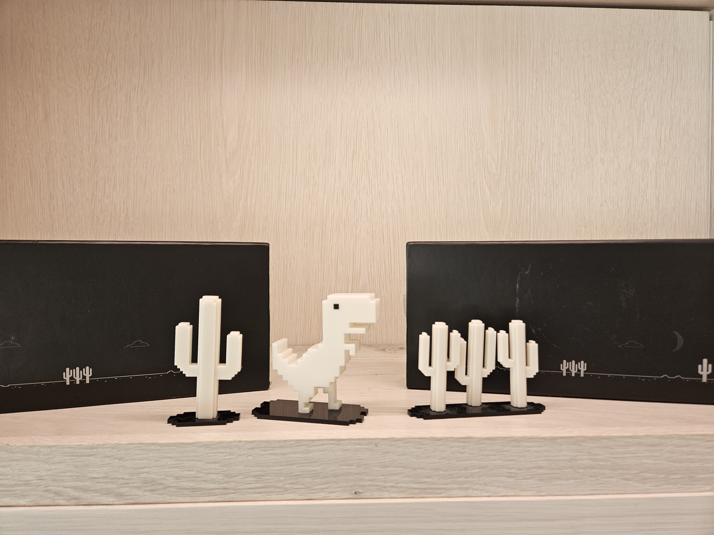

## 2025년을 돌아보며

2025년은 상당히 혼란스러운 한 해였다. 당연히 핵심 원인은 AI다. 직업에서, 삶에서 많은 부분에 AI가 침투했으며 시시각각 변화하고 있다. 사회적으로도 개인으로도 많은 혼란을 느낀 한 해였다. 그렇다고 부정적이기만 하지는 않다. 한편으로는 어떻게 바뀌어갈지 기대가 되기도 한다. 더 많은 기회가 생긴 것도 사실이다. 더 많은 정보를 더 쉽게 얻을 수 있다. 

각설하고 그러면 2025년 회고를 시작해보자.

## 책읽기도, 글쓰기도 거의 하지 않았다.

### 책읽기 부문

우선 반성...해야 할지도? 모르는 부분. 책을 많이 안 읽었다. 올해 하반기 읽은 책은 다음과 같다.

- [구글이 목표를 달성하는 방식 OKR](https://www.aladin.co.kr/shop/wproduct.aspx?ItemId=174470429)
- [사람을 움직이는 피드백의 힘](https://www.aladin.co.kr/shop/wproduct.aspx?ItemId=318620862
- [Tidy First](https://www.aladin.co.kr/shop/wproduct.aspx?ItemId=337084402)
- [자유론](https://www.aladin.co.kr/shop/wproduct.aspx?ItemId=366282152) (읽는 중)

아쉽게도 그 어느 책도 후기를 남길 만큼 인상적이었던 책은 없었다. 대신 여기에 짧게 한 줄평을 옮기려 한다.

- 구글이 목표를 달성하는 방식 OKR: OKR에 대해 손에 땀을 쥐는 흥미로운 스토리로 알려준다.
- 사람을 움직이는 피드백의 힘: 역시 이야기 형태로 가볍게 알려주는 좋은 피드백
- Tidy First: 읽어볼만은 했지만 이 돈주고 읽고 싶지는 않다.

### 글쓰기 부문

이건 명백하게 쓰지 않았다. 변명하자면 요즘은 뭐랄까 딱히 쓸 글이 없다. 정보 습득도 쉽고, 막 꽂혀서 공부하는 것도 없고, 요즘은 세상 대부분의 개발 글들이 'AI로 딸깍하니 뭐가 됐어요~' 하는 글이라 솔직히 공유하고 싶은 생각이 마땅히 없다. 물론 글이라는 게 그런 것만 써야하는 것은 아니지만...의무적으로 쓰고 싶은 건 아니라...

## 사이드 프로젝트 개발은 여전히 활발하게

사이드 프로젝트는 2024년에도 그러했지만 2025년도에도 여전히 활발하게 했다. 이에 대한 내용은 다음 글에서 더 다루도록 하고 간단하게만 얘기하고 넘어가보자. 

AI 덕분에 더 많은 것들을 할 수 있게 되었다. zero to one이 쉬워진 것은 물론이고 생산성에서도 확실히 늘어난 게 있었다. 덕분에 항상 아주 천천히 진행되던 사이드 프로젝트들이 어느 정도 속도감이 붙었고, 새로운 것들도 더 많이 할 수 있게 되었다. 

AI를 필두로 개발자 종말론이 들끓는 세상이지만, 나는 여전히 개발자의 정의가 바뀔 뿐 개발자는 사라지지 않는다고 믿고있다.

## 미국 방문

### AWS Re:invent

회사에서 좋은 기회를 얻어 AWS:Reinvent에 참여하기 위해 미국 라스베가스에 가게 되었다. 사실 나는 미국에 대한 환상도 없고, 미국에서 일하는 것도 내 목표에는 없다. 그럼에도 나는 스스로 기회가 생겼을 때 가지 않으면 평생 가지 않을 사람이라는 것을 알기 때문에 다소 억지로라도 갔다. 

보고 느끼거나 배운 건 그닥 없다. 세상은 이렇게 보이지 않는 곳에서 분주하게 바뀌고 있구나 라는 생각은 들었다. 확실히 AI 그리고 Agent가 주요 키워드였고 혁신적인 무언가가 있지는 않았다.

_5등한게 자랑_

### 샌프란시스코

_미국 샌프란시스코 구글 본사_

겸사겸사 샌프란시스코도 다녀왔다. 사실 회사덕질하러 간 게 큰데 구글, 애플 등에 방문했다. 한거라곤 굿즈샵 가서 굿즈 사기가 다였다. ㅋㅋㅋ 애플은 사실 그냥 애플스토어와 같아서 살건 마땅히 없었고 구글은 오래전에 사려고 눈독들여놨던 피규어를 샀다.

_겁나 귀엽습니다_

회고글이라 미국 간 얘기는 여기까지

## 생활 패턴 변경

미국에서 시차적응 안된김에 그냥 생활패턴을 아침으로 옮겼다. 이 편이 미국에 있는 PM과도 소통하기 좋을 것 같아 그렇게 하기로 했다. 생활이 특별하게 변한 것은 없다. 이 패턴은 더 오래 유지해봐야 더 좋고 나쁜 것을 알 수 있을 것 같다.

## 영어 공부

뭔가 작년에도 영어공부 해야겠다고 생각했던 것 같은데 2025년도의 영어공부는 대차게 망했다. TED 유튜브 채널도 구독하고 스픽 결제도 했었는데, 안하더라. 
- TED: 생각보다 어려웠음. 원어민 발음이라 더 안들리고 내용도 살짝 난이도가 있어서 도망침
- 스픽: 재미없어서 하다 말았다
- 쓰기: 딱히 안함

근데 미국가서 영어를 쓰려다보니 생각보다 더 처참했다. 못알아듣고 못말하고. 물론 바디랭귀지와 기초회화로 어떻게든 살아남기는 했는데 영어 해야겠다고 느낀 지점이다.

추가로 2026년도에는 영어를 더 해야겠다고 느낀 점은 AI 때문도 있다. 토큰 비용을 아끼기 위함도 있고, 영어로 요구할 때 성능이 더 좋다는 말도 있어서 좀 더 잘해야지 싶은 마음이 있다.

아무튼 영어 공부도 좀 계획을 세우고 이것저것 해보지 싶다.

## 카메라 공부...?

이건 개인적인 욕심인데 최근 360도 카메라에 자꾸 눈이 간다. 360도 영상 + Three.js로 간단한 플레이어를 만들어보면 재미있을 것 같은데 이거는 생각만... 생각만...