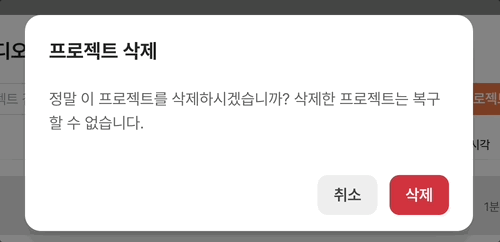
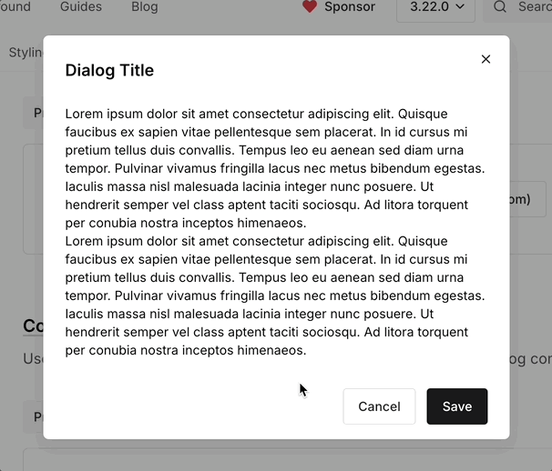
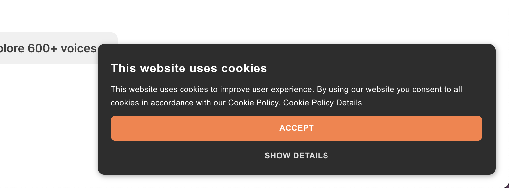
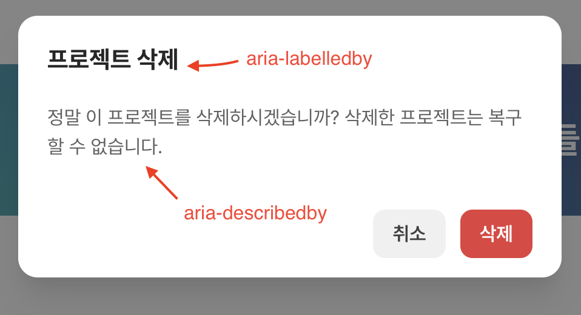
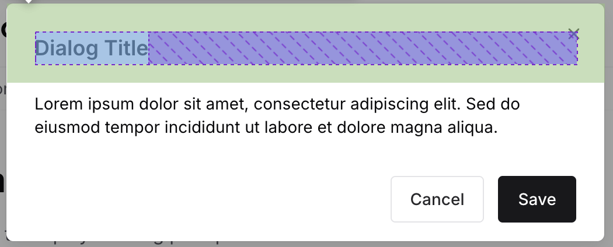
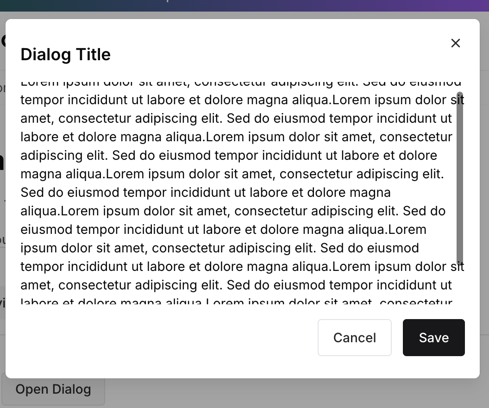
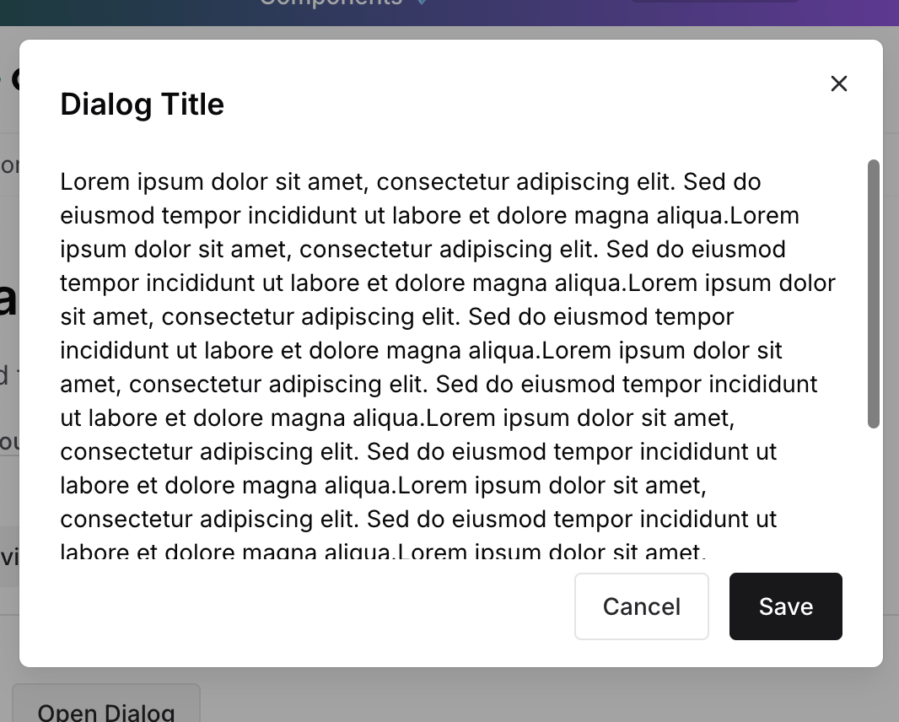

## 모달의 특징
- 모달(혹은 다이얼로그)는 화면 혹은 또 다른 모달 위에 겹쳐서 올라갈 수 있다.
- 모달 뒤의 화면은 비활성화 되어야 한다. 즉 활성화된 모달을 제외한 밖의 영역이 비활성화 된다.
- 이 밖의 영역과 상호작용하면 모달은 닫혀야 한다.
- 모달을 닫지 않으면 키보드 포커스를 모달 밖으로 옮길 수단은 없다.
	- 즉, Tab을 계속 눌러도 모달 안에서 focus가 순환한다.
- `Tab`과 `Shift` + `Tab`으로 모달 내부를 이동할 수 있다.
	- 별도의 Tab Sequence가 생긴다.

## `ESC`로 끌 수 있어야 한다

Tab, Shift Tab을 통한 포커스 이동 외에 키보드 상호작용이 되어야하는 것이 딱 한 가지 더 있다. `ESC`로 모달을 끌 수 있어야한다.

## 중요한 버튼이 포커스를 먼저 가져가게 한다

 앞서 별도의 Tab Sequence가 생긴다고 했다. 말인즉슨, 모달을 열면 포커스가 모달 안으로 이동한다.

일반적으로는 포커스할 수 있는 첫 번째 요소에 포커스가 가간다.

모달의 내용에 따라 처음 포커스될 요소의 순서를 바꿔주는 게 좋은데, 예를 들어 모달 하단에 "확인", "계속" 같은 버튼을 두는 경우 여기에 `tabindex="1"` 과같이 포커스 우선순위를 높게 주는게 좋다. 반면, "정말 삭제하시겠습니까?" 같이 경고성 모달인 경우 "취소" 버튼에 포커스 우선순위를 높게 주는게 좋다. 그리고 "닫기" 같은 버튼도 그다음 포커스 우선순위에 포함해 주는 게 좋다.


_취소에 먼저 포커스가 가고 삭제로 포커스가 이동한다_

하지만 위 예시와 같이 가장 흔하게 사용되는 형태인 하단에 "취소" 혹은 "확인" 버튼이 있는 모달의 경우 `tabindex`를 사용하지 않고 포커스를 바로 우선되는 버튼으로 이동시킬 수 있다.

바로 Footer 영역의 flex를 `row`가 아닌 `row-reverse`로 설정하고 버튼의 순서를 "확인", "취소" 순으로 두는 것이다.

```html
<div class="modal-footer">
  <button type="button">Save</button>
  <button type="button">Cancel</button>
</div>
```
```css
.modal-footer {
  display: flex;
  flex-direction: row-reverse;
}
```

이렇게 되면 버튼의 순서는 `Cancel`-> `Save`순이 되지만 포커스는 `Save` -> `Cancel`순서가 된다.



## 모달에는 `aria-modal`을 설정해 주는 게 좋다

`aria-modal`은 이 대화상자가 모달이며, **배경 콘텐츠와의 상호작용을 차단**하게 만들어준다. 즉, `aria-modal` + `role="dialog"` 둘 다 있어야 우리가 아는 모달이 된다고 볼 수 있다. 반대로 `aria-modal`이 없는 `role="dialog"`는 비모달(non-modal) 다이얼로그다.


_non modal dialog 예시_

그 외에도 아래와 같은 형태의 모달이라면 `aria-labelledby`, `aria-describedby`를 설정해 주면 좋다.


## role은 "dialog"와 "alertdialog"가 있다

모달에 사용할 수 있는 role은 `dialog`, `alertdialog`가 있다.
`alertdialog`는 유저에게 아주 중요한 메세지이기 때문에 유저의 흐름을 방해한다.

실제로 `alertdialog`는 `aria-live="assertive"`속성을 포함하고 있다. 따라서 스크린 리더는 `alertdialog`의 경우 읽던 것을 중단하고 `alertdialog`의 내용을 먼저 읽는다.

shadcn에서 [dialog](https://ui.shadcn.com/docs/components/dialog)와 [alert dialog](https://ui.shadcn.com/docs/components/alert-dialog) 동일하게 생긴 두 컴포넌트를 분리해 둔 것이 의아했다면 이런 이유에서이다.


## 전체 모달에 padding을 넣지 않는다
이건 항상 적용되는 것은 아닌데, 때때로 난감할 때가 있어서 이렇게 해두면 좋다.


이건 차크라(v3)의 dialog인데, 모달의 `<Dialog.Header>`, `<Dialog.Body>` `<Dialog.Footer>`를 각각 Padding으로 감싸놓은 것을 볼 수 있다. 전체 박스를 감싸는 패딩을 넣으면 되는데 왜 이렇게 각 파트에 별도로 패딩을 감싸는지 의아했었는데, 최근에 깨달았다.

바로 대화상자 전체에 padding을 넣으면 `<Dialog.Body>`에 스크롤이 오른쪽 끝에 붙지 않는다.

_스크롤바가 박스 중간에 생긴다_

반면 파츠별로 패딩을 주면, Body에 스크롤을 주더라도 오른쪽 끝에 스크롤이 생기게 된다.


_스크롤이 오른쪽 끝에 붙는다_

## 마지막 여담
HTML에 Dialog 스펙이 발표되고 난 뒤, 최신 UI 라이브러리들은 Modal이라는 표현보다 Dialog를 쓰는 것 같다.

## Reference
https://www.w3.org/WAI/ARIA/apg/patterns/dialog-modal/
