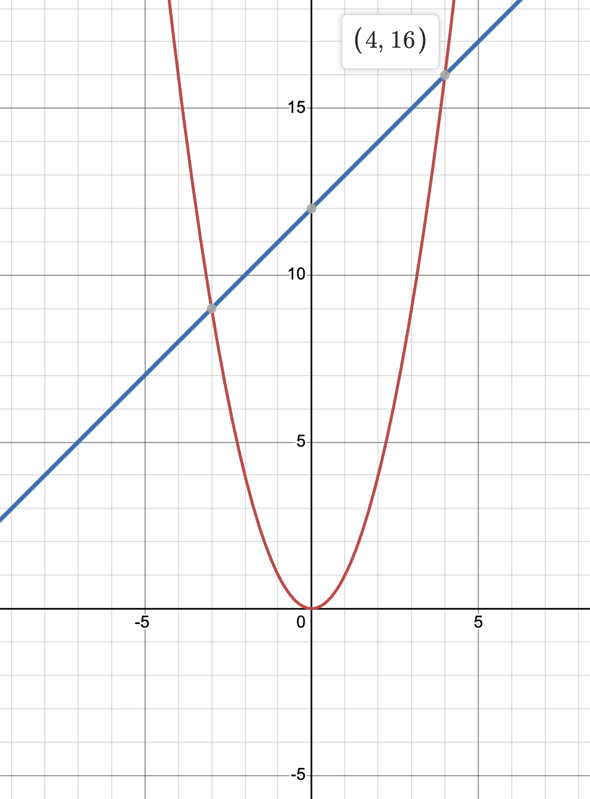

# 0\. 시작하기

## 왜 알고리즘을 공부해야할까?

살짝은 당연한 이야기지만, 그래도 이유를 분명히 하고 출발하자. 왜 우리는 알고리즘을 공부해야할까?

<p></p>

우리가 알고리즘을 공부함으로써 무얼 얻게 될까? 다양한 알고리즘을 알게 된다.

다양한 알고리즘을 알면 무엇이 좋은가? 문제 해결에 있어 적절한 알고리즘을 선택할 수 있게 된다.

문제 해결에서 적절한 알고리즘의 선택은 왜 중요한가? 적절한 알고리즘은 문제를 더 효율적으로 풀 수 있게 만들기 때문이다.

<p></p>

> 알고리즘을 공부하면 문제를 더 효율적으로 풀 수 있게 된다.

<p></p>

n개의 원소를 가지며 정렬된 배열에서 특정 원소 x를 찾는 간단한 문제를 이야기해보자.

<p></p>

순차 탐색(sequential search)을 하는 경우 x를 찾는데 최악의 경우 n번의 비교를 해야한다.

이분 탐색(binary search)을 하는 경우 x를 찾는데 최악의 경우 logN+1번의 비교를 해야한다.

<p></p>

지구의 모든 사람을 정렬한 상태에서 '나'를 찾는 문제라고 한다면 순차 탐색으로는 80억번(2024년 기준)의 연산이 필요하다. 반면 이분 탐색으로는 33번의 비교만 하면 된다는 것이다. 시간적으로도, 에너지적으로도 순차 탐색보다 효율적이다.

<p></p>

CPU의 성능은 계속 좋아지고 있지만 일반적으로 1초 안에 약 10억번의 계산을 할 수 있다고 본다.

> 10억번 = 1초

따라서 순차 탐색으로는 8초, 이분 탐색으로는 0.000000033 초만 소요된다.

<p></p>

이렇게 설명하지 않아도 효율적인 계산의 중요성은 알 것이라 생각하니 여기까지만 하고 넘어가자.

## 알고리즘의 효율성 분석하기

A알고리즘이 B알고리즘보다 효율적인가?를 비교하기 위해서는 알고리즘의 효율성을 계산해야한다. 컴퓨터에서 문제를 푸는데에는 2가지의 자원이 사용된다. 바로 메모리와 CPU이다. 효율적으로 연산했다는 말은 메모리와 CPU를 효율적으로 사용했다고 볼 수 있다.

<p></p>

### CPU를 효율적으로 사용했다는 것

CPU를 효율적으로 썼다는 것은 어떻게 알 수 있을까? CPU가 동작한 시간을 비교하는 것은 효율성을 계산할 수 없다. CPU마다 성능이 다르기 때문이다. CPU가 수행한 명령의 수도 정확한 비교는 아니다. 사용한 프로그래밍 언어에 따라 같은 알고리즘에서도 CPU가 사용한 명령의 수가 달라지기 때문이다.

<p></p>

이처럼 물리적인 단위의 비교는 공정하지 않기 때문에 CPU의 효율성은 **논리적인 단위**에서 비교한다. 이 논리적인 단위는 어떤 목적으로 알고리즘을 비교하는가에 따라 선택할 수 있다. 가장 범용적이고 일반적인 단위로는 비교문(exchange statement)이 있다. 할당문(assignment statement)을 얼만큼 사용했는지를 비교할수도 있다. 앞으로는 이러한 논리적인 단위를 **단위연산**이라고 하겠다.

<p></p>

단위연산의 실행횟수는 입력값에 의해 좌우된다.

n개의 원소를 가진 배열에서 x를 찾는 문제에서 비교문을 단위연산으로 할 때, 단위연산은 최소 1번, 최대 n번 일어난다.

n개의 원소를 모두 더하는 문제라면 단위연산은 고정적으로 n번 일어난다.

<p></p>

이렇게 입력 n에 대해 알고리즘을 통해 일어나는 단위연산의 수를 **시간복잡도**라고 한다.

<p></p>

다음의 알고리즘을 예로 들자.

```js
function sum(...args) {
  let total = 0;
  for (let i = 0; i < args.length; i++) {
    total += args[i];
  }
  return total;
}
```

<p></p>

모든 원소를 더하는 연산을 하는 위의 sum 알고리즘은 비교문을 단위연산으로 했을 때 `args.length` 만큼의 시간복잡도를 가진다.

<p></p>

### 메모리를 효율적으로 사용했다는 것

메모리를 효율적으로 사용했다는 것도 마찬가지로 물리적인 계산이 아닌 논리적인 단위로 접근한다. 사용한 단위연산의 수를 **공간복잡도**라고 부른다.

<p></p>

같은 알고리즘에서 공간복잡도를 계산해보자

```js
function sum(...args) {
  let total = 0;
  for (let i = 0; i < args.length; i++) {
    total += args[i];
  }
  return total;
}
```

자바스크립트는 변수가 고정적으로 double형이므로 8byte를 사용한다. sum 함수가 동작하는 동안 총 2개의 변수 total, i 가 사용되므로 공간복잡도는 16byte다.

<p></p>

### 효율적인 알고리즘이란?

지금까지의 정의를 바탕으로 효율적인 알고리즘의 정의를 내리자.

> 알고리즘이 효율적이다 = 시간복잡도와 공간복잡도가 비교적 낮다

상황에 따라서 공간복잡도가 높아도 시간복잡도가 더 낮은 알고리즘이 있을 수 있고 그 반대도 있을 수 있다. 이런 경우 문제에 따라 적절한(더 효율적인)알고리즘이 달라진다. 극한으로 적은 메모리를 가진 상황이면 공간복잡도가 더 적은 알고리즘이 효율적인 알고리즘이 될 수도 있을 것이다.

## 최선, 평균, 최악의 복잡도

앞서 알고리즘은 입력에 따라 실행되는 단위연산의 수가 달라질 수 있다고 언급했다. n의 길이를 갖는 배열 A에서 원소 x의 위치를 찾는 알고리즘을 예로 들자.

<p></p>

```ts
// 설명을 위해 언어를 타입스크립트로 바꾸겠다.
function findIndex(A: number[], x: number) {
  const n = A.length;
  for (let i = 0; i < n; i++) {
    if (A[i] === x) return i;
  }
  return -1;
}
```

<p></p>

만약 A의 0번 인덱스에서 x를 찾았다면 시간복잡도는 1이다. 그리고 이보다 낮은 시간복잡도가 나올 수 있는 경우는 없다.

만약 A 배열에서 x를 찾지 못했다면, 시간복잡도는 n이다. 그리고 이보다 높은 시간복잡도가 나올 수 있는 경우는 없다.

위의 케이스는 각각 최선의 시간복잡도, 최악의 시간복잡도이다.

> 최선의 시간복잡도 = 1 최악의 시간복잡도 = n

<p></p>

평균복잡도도 이야기해볼 수 있을 것이다. 이를 위해선 x가 A 배열 안의 특정 위치에 존재할 확률을 고려해야한다. 공평하게 1/n이라고 하자. 부가 조건으로 x는 A배열의 원소중 하나여야한다. (이 조건이 없으면 x를 못찾는 경우를 계산해야해서 복잡해진다)

<p></p>

> x를 1번만에 찾을 확률 = x를 2번만에 찾을 확률 = ... = x를 n번만에 찾을 확률 = 1/n

x가 k 인덱스에 위치할 때 단위 연산은 k번 일어난다.

이를 통해 단위연산의 평균은 다음과 같이 계산된다.

<p></p>

> \= (1+2+3+...+n)/n = n\*(n+1)/(2\*n) = (n+1)/2

평균 시간복잡도는 (n+1)/2로 n=10일 때 5.5번의 단위연산이 평균적으로 발생한다.

당연히 현실 세계에선 위와 같이 k가 위치할 확률이 공평하지 않을 가능성이 크기 때문에 평균 시간복잡도의 계산이 더 복잡해질 가능성이 크다.

<p></p>

### 근데 이건 왜 언급하나요?

문제에 따라 다른 복잡도를 비교해야할 수 있다. 최악의 케이스는 대부분의 문제에서 고려해야하고 그래서 중요하다. 하지만 고객이 얼마나 최고의 시나리오에서 얼마나 빨리 배송을 받을 수 있는가? 배송은 평균적으로 얼마나 소요되나? 등을 계산해야하는 문제를 마주할 수도 있다. 그러니 내가 어떤 문제를 마주하고 있는가를 알고 그에 맞는 복잡도를 고려할 수 있기 위해 위의 개념을 언급한다. 그리고 이는 복잡도의 비교에서 이어진다.

## 복잡도의 비교, Big-O 표기법

아쉽지만 ~마크다운에서 LaTex를 표기하는 방법을 아직 잘 몰라서~ 학문적인 깊이를 파기 위해 글을 작성중인 것은 아니기 때문에 수학적인 내용을 대거 패스할 예정이다. 그렇지만 Big-O가 어떤 개념인가는 살짝 짚고 가자.



A알고리즘의 시간복잡도는 n^2, B알고리즘의 시간복잡도는 n+12이라고 하자. `n<4`일때 까지는 B알고리즘보다 A알고리즘의 시간복잡도가 더 낮다는 것을 알 수 있다. 하지만 n이 4보다 커지는 순간 A 알고리즘의 시간복잡도는 B알고리즘보다 항상 더 높아진다.

<p></p>

마찬가지로 다른 낮은 차수의 항들이 어떻게 됐든 최고차항이 n^2인 알고리즘보다 최고차항이 n^3인 알고리즘이 나중엔 시간복잡도가 더 높게 된다.

<p></p>

이처럼 n이 충분히 클때 최고차항이 높은 복잡도를 가진 알고리즘이 최고차항이 낮은 복잡도를 가진 알고리즘보다 높은 복잡도를 가지게 된다.

<p></p>

이 최고차항 함수들을 묶어서 Big-O 표기법으로 O()으로 나타낼 수 있다. 예를 들어 3\*n^2+10n은 O(n^2)에 속한다. O(n^2)의 의미는 **점근적 상한**이 n^2라는 뜻이다. 이 Big-O로 궁극을 비교할 수 있는데, O(n^2)은 O(n^3)보다 궁극적으로 작다.

<p></p>

<p></p>

같은 논리로 O(2^n)은 O(nlogn)보다 크다. 쉽게 말해서 **극한의 상황에서 최고차항만 비교해도 누가 더 높은 복잡도를 가지는지 알 수 있다**는 뜻이다.

<p></p>

이 이상의 수학적인 정의와 증명은 빅오표기법으로 검색해서 알아보자.

<p></p>
<p></p>
