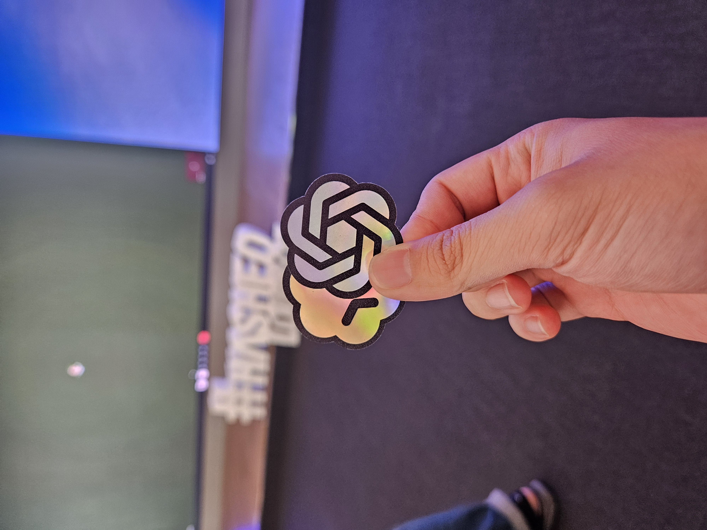

## 2026년 상반기는 어떠했나

글을 쓰기 앞서 작년 상반기 리뷰는 어떠했는지 되돌아보았다. 충격적이게도, 1년간 해온 것들이나 생각들이 너무 낡고 오래된 것처럼 느껴져서 충격적이었다.

## 무엇을 이루었는가?

2026년 상반기에 달성한 것과 임팩트 있었던 것의 관점에서 정리한다.

### 끝없이 실험하고 관찰하기

우선 우리가 미국 유저에 대해 잘 모른다는 것을 인정했다. 해외는, 특히 미국이라는 나라는 유저에 따라 사용하는 방법도, 관심사도, 심지어는 상식도 천차만별이었다. 예를 들면, 한국 유저는 설명하지 않아도 바로바로 사용하는 기능들을 미국에선 절대로 사용하지 않는 등이다. 한국과 다를 것임은 알았지만 머리로만 이해했었나보다.

그래서 상반기에는 유저를 더 잘 알아가는 것을 목표로 세웠다. 주된 목표는 US 유저의 제품 경험 개선이었다. 포인트 컬러 변경부터, 기능 발견, 데모를 추가하는 등의 다양한 범위에서 실험이 진행되었고 총 15개의 실험을 설계하고 진행했다.

결과적으로 Signup 지표는 5% 상승으로 목표치를 초과 달성할 수 있었다. 지표 외에도 부수적인 것들을 얻을 수 있었는데, 그중 가장 좋았던 점은 하나의 실험이 다음 실험의 트리거가 되어 지속적으로 유저를 관찰하고 데이터를 획득하는 사이클이 만들어졌다는 점이다.

우리팀에 부족하다고 생각하고 있던 근거 있는 개발 역량이 채워졌기 때문에 개인적으로 꽤나 기쁜 성과이다. 이를 기반으로 하반기에는 더 유의미한 성과를 이끌어낼 수 있을 것이라 기대한다.

### 회사 디자인 시스템은 어떤 진전이 있었나

큰 변곡점이 있었다. 바로 Shadcn을 도입하고 사용 방법에 대해 합의한 것. 다만 자세한 내용은 여기에 적기엔 많아 다음 글에서 따로 다루려고 한다.

먼저 기존의 디자인 시스템 진척 상황은 다음과 같다

- Chakra에 의존하는 기존 디자인 시스템을 내재화된 디자인 시스템으로 교체한다.

디자인 시스템 진행에 다음의 변경이 있었다.

- 빠른 교체를 위해 Shadcn을 기반으로 디자인 시스템을 새로 구축
- 이 라이브러리는 디자이너와 합의되어야만 변경할 수 있도록 약속
- 새로 만드는 페이지들은 새 디자인 시스템을 쓸 것을 약속

달리는 기차가 된 제품에서 사용성을 기반으로 디자인 시스템을 처음부터 구축해나가는 것은 너무 오랜 시간이 걸리는 일이었다. 이에 디자이너, 개발자간에 합의가 있었고 Shadcn이 구축해놓은 디자인 시스템을 그대로 가져와 제품에 디자인 시스템을 정착시키는 것을 우선으로 하기로 했다. 이에 따라 디자인 시스템 운영 원칙도 세워졌다. 합의 하에만 라이브러리를 수정할 것이고, 새 페이지들은 새 디자인 시스템을 쓸 것을 약속한 것이다. 이는 디자이너의 이해와 개발자의 이해를 동기화하기 위함이었다.

그러고서 상반기 동안 틈틈이 레거시 디자인 시스템을 걷어내는 작업을 했고, 결과적으로 1.5개월간 전체 사용처 1200곳에서 600곳으로 50% 정도 걷어낼 수 있었다. 새로 만드는 페이지들은 Chakra를 사용하지 않고 있기 때문에 Chakra의 실제 영향력도 50%로 감소했다고 볼 수 있다. 이전에 한 분기간 10개의 컴포넌트를 만든 것에 비교하면 이건 꽤 놀라운 일이었다.

제품에 대규모 업데이트가 있어 개선은 일시 중단했고, 하반기에 조금씩 옮겨서 올해에 전체 마이그레이션하는 것이 목표이다.

디자이너와 개발자 간의 합의가 이뤄진 것이 큰 변화라 생각한다.

## 하반기 방향 점검

작년에 설정한 방향은 다음이 있었다.

- 설계 공부
  - 리팩토링 잘하기
    - 사이드 프로젝트에서 리팩토링 많이 하기
  - TDD, 디자인 패턴, 오브젝트 등 설계 관점의 공부

- AI는 잘 쓰는 사람 잘 따라가기
  - 이미 잘하고 있는 사람들 잘 벤치마킹하기
  - 나만의 프로세스 갖추기

여기에 'AI가 말하는 것을 잘 소화하기' 항목을 추가하려 한다. 요즘 AI의 환각은 꽤 교묘해서 알아차리기가 어렵다. 특히 어지러운 용어를 늘어놓아 피로감을 주는데, 그러다 보니 일단 하라고 하고 결과를 본 뒤 수정을 지시하는 일이 늘었다. 별로 유효한 토큰 사용은 아니라고 보여진다. 따라서 앞으로는 작은 부분의 설계를 자주 하려고 한다.

## 잡다구리한 생각들

너무 짧아 글로 쓰지 못하거나 다루지 못한 것들을 정리해본다.

### 사이드 프로젝트 정리

연말 회고에 결과들을 자세히 다룰 거라 진행 중인 것들만 간단하게 정리해 보려 한다.

#### [band-up](https://github.com/dev2820/band-up) - 개발 중

IELTS 준비생을 위한 단어장 앱이다. 단순히 뜻과 단어를 회상하는 기존 단어장들과 달리 단어를 보고 유사어를 떠올릴 수 있는 연습을 할 수 있다. 아직 코드 다듬기 & TTS 추가가 남았다.

#### [qr-maker](https://github.com/dev2820/qr-maker) - 출시 준비 중

QR을 만들고 전시할 수 있는 앱이다. 잘 모르는 분야에 대해 AI로 얼마나 구현할 수 있는지 테스트해 보려고 만들었다. 디자인은 Claude Design, 코딩은 Claude Code를 사용했고, 코드는 일절 수정하지 않고 지시만으로 만들었다.

#### [tmux-claude-usage](https://github.com/dev2820/tmux-claude-usage)

tmux에서 사용하려고 만든 작은 유틸리티. 클로드 사용량 및 세션 초기화에 남은 시간을 보여주는 용도

#### [image-optimizer](https://github.com/dev2820/image-optimizer)

개발하다 보면 반복적으로 사용하는 툴들을 서비스로 만들어 보는 작업의 일환이다. 이미지 최적화에 매번 무료 사이트들을 이용했는데, 보안상 좋지도 않고 개수 제한에 걸릴 때가 많아 직접 만들었다. 서버 없이 클라이언트에서만 돈다는 게 포인트.

### AI 사용 현황

_6월 28일 codex meetup에서_

최근 AI를 어떻게 쓰고 있는지, 어떻게 생각하는지 주저리주저리 해 보려 한다. 최근 주로 사용하는 코딩 에이전트를 Claude Code에서 Codex로 옮겼다. 이 결정은 새 모델(5.6 Sol,Terra,Luna)에 대한 기대가 아닌 Claude 혹은 Claude Code에 대한 피로감에서 비롯되었다. 최근 느낀 불편함은 Claude가 느려졌고, 불필요한 액션이 많아졌다는 것이다.

먼저 Claude를 보통 max에 두고 쓰는데, 보통 작업 수행에 있어 2분~4분의 시간이 소요되었다. 어떤 질문은 심지어 8분이 걸리기도 했다. 다음은 불필요한 액션, 시키지 않은 일을 해서 되돌리거나 특히 불필요한 주석을 다는 것에 피로감을 느꼈다. 대화 내용에 들어간 잡다한 컨텍스트를 전부 적어내는데, 굳이 '이 컴포넌트는 A 컴포넌트와 동일한 패턴을 따라 (A 내부동작에 대한 설명)...' 같은 주석을 적는다거나 한다. 하네스가 잘못된 것일 수 있겠지만 주석에까지 하네스 엔지니어링을 하고 싶지 않았다.

이러한 이유로 최근에는 Codex를 써 보고 있다. 안 그래도 Codex에 관심을 두고 있다가 최근 Codex Meetup에서 Codex의 기능들이나 사용한 케이스들을 보고 그냥 덜컥 옮겨야겠다고 마음먹었다.

여담으로 회사에서 노는 AWS 베드락 위에 glm 올려 줘 잠시 써 봤는데, 써 보니 빠르고 답변도 준수해서 좋았다. glm을 개인 서버에 올리려면 얼마나 많은 그래픽 카드가 필요한지 찾아봤는데, H200이 8장 필요하다고 해서 이 이상 생각하지는 않기로 했다.

### AI는 개발자 커리어의 종말인가?

[why-ai-hasnt-replaced-software-engineers](https://www.normaltech.ai/p/why-ai-hasnt-replaced-software-engineers)

근래 AI가 가져올 대규모 해고에 대한 걱정 어린 시선이 많았고, 실제 MS, Meta같은 대기업들은 대규모 해고를 감행했다. 나 또한 현업에 있으며 그런 걱정을 하지 않을 수 없었고, 나의 입장을 정해야했다. 그렇다면 실제로 개발자의 시장 가치는 0이 되어가고 있고, 해고는 당연한 수순인가? 위 글은 이에 대한 나의 생각을 잘 대변하고 있다.

> "AI가 그들을 대체해서요." 라는 답변은 그 엔지니어가 이미 무능해서 자르고 싶었을 것. 그리고 비용절감에 사용된 변명이라 생각한다.

다만 단순히 기업의 악마적 결정이 작금의 사태를 만들고 있다고 생각하지는 않는다. 아이러니하게도 AI는 개발자가 더 많은 것을 할 수 있게 하는 축복을 내렸지만 동시에 더 많이 하지 않으면 안 되는 저주를 걸었다. 더 이상 코딩은 그 자체로 가치가 되지 못한다. 우리는 스스로 반성해야 한다. 나는 스스로 가치를 창출하는 사람인지 말이다. 내가 남이 만든 가치를 실행하는 사람에 불과하다면 식량이 한정된 섬에서 서로를 죽이는 카니발리즘의 희생양이 될 것이다.

변화는 두렵지만 피할 수 없는 것, 이제 남은 고민은 어떻게 잘 즐겨볼지 인 것 같다
