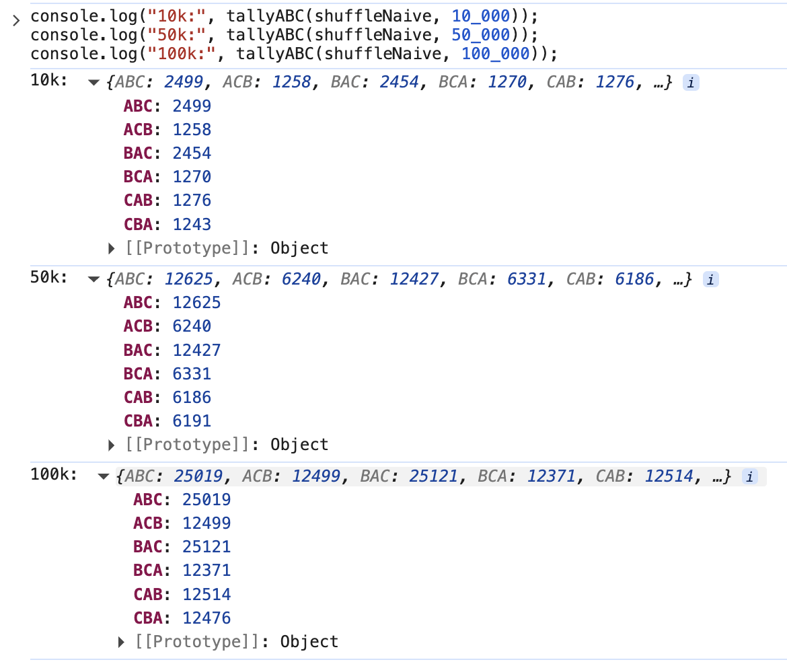
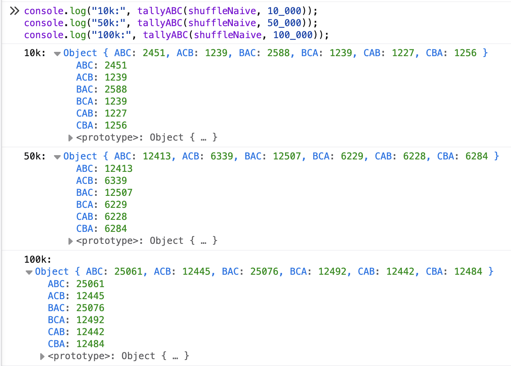
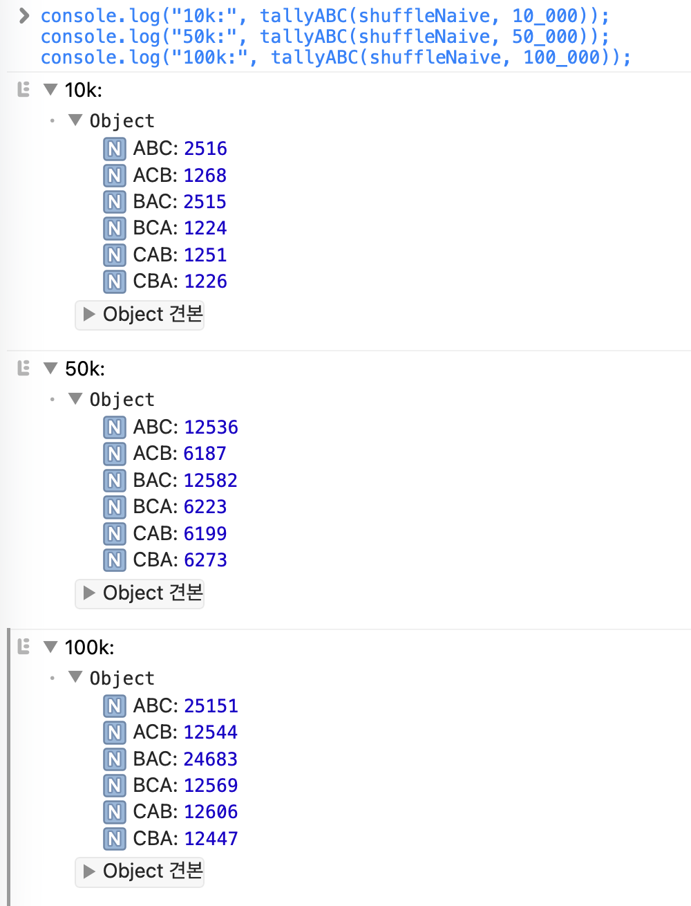
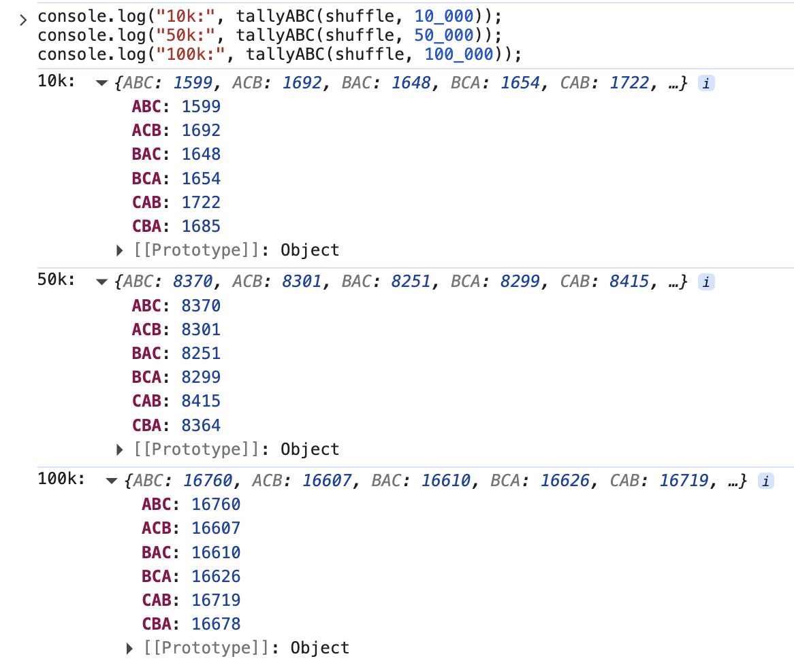
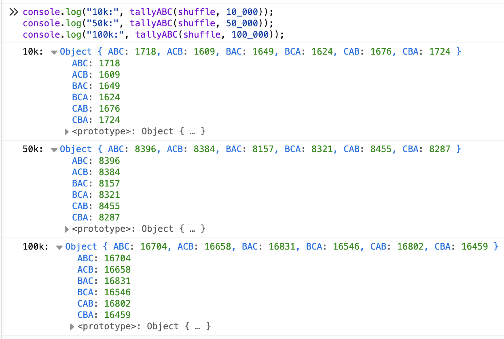
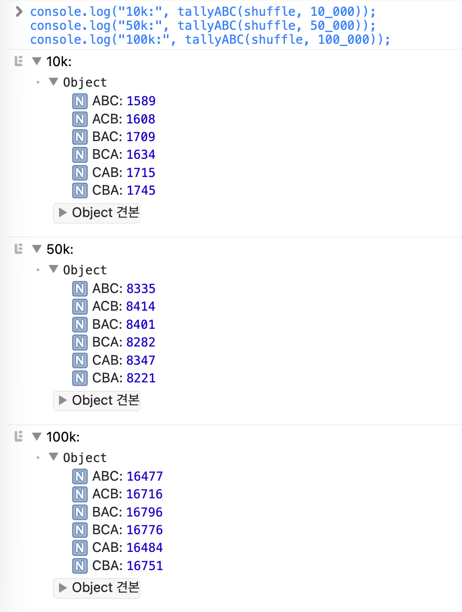

## 우리는 어떻게 배열을 랜덤하게 섞을까?

스포티파이나 유튜브 같은 서비스의 재생 목록 기능을 만든다고 가정해 보자. 사용자는 좋아하는 음악을 편향 없이 골고루 듣고 싶어 하므로(그렇게 생각하자), 셔플을 눌렀을 때 재생 목록이 공정하게 섞이게 하고자 한다.

여기서 말하는 공정한 셔플은 다음을 말한다.

> 셔플을 실행할 때 가능한 모든 순서가 동일한 확률로 선택된다. 곡이 n개라면 각 곡이 첫 곡이 될 확률은 1/n이고, 셔플을 다시 실행할 때마다 이전 결과와 독립적인 새로운 순서가 생성된다. 구현은 전체 곡 수 n에 대해 선형 시간으로 동작한다.

곡 목록은 주어졌다. 이들을 유저에게 어떻게 랜덤하게 들려줄 수 있을까?

## 가장 쉬운 접근 방법: sort와 random

처음 셔플을 구현하려 하면 가장 먼저 떠오르는 도구는 배열의 sort다. "비교 함수가 음수면 왼쪽, 양수면 오른쪽"이라는 규칙만 지키면 정렬 순서를 마음대로 바꿀 수 있다. 그렇다면 비교 함수가 무작위로 음수나 양수를 내도록 만들면 원소들의 상대적 순서가 제각각 뒤섞이지 않을까? 한 줄이면 끝난다.

예시 코드

```js
// 복사본을 섞고 싶을 때
const shuffled = [...songs].sort(() => Math.random() - 0.5);

// 원본을 직접 섞아도 된다면
songs.sort(() => Math.random() - 0.5);
```

이 방법은 짧고, 표준 API만으로 구현되는데다 얼핏 보면 랜덤하게 정렬하는 듯 보인다.
정렬 비용은 O(nlogn)이지만 충분히 짧은 배열에선 유의미한 시간 차이를 만들지 않는다.

이 한 줄짜리 접근은 매우 유혹적이다. 하지만 다음 섹션에서 보듯 공정한 균등 셔플을 보장하지 않는다. 왜 문제가 되는지, 어떤 편향이 생기는지는 살펴보자.

### sort와 Math.random - 0.5의 함정

이 방법이 정말 "균등한" 결과를 만드는지, 간단한 실험으로 확인해 보자.

#### 실험 코드

```js
// 실험 대상: sort + Math.random - 0.5
function shuffleNaive(base) {
  return base.slice().sort(() => Math.random() - 0.5);
}

// ["A","B","C"] 6개 순열 분포 집계
function tallyABC(shuffle, trials) {
  const keys = ["ABC", "ACB", "BAC", "BCA", "CAB", "CBA"];
  const counts = Object.fromEntries(keys.map((k) => [k, 0]));
  for (let t = 0; t < trials; t++) {
    const key = shuffle(["A", "B", "C"]).join("");
    counts[key]++;
  }
  return counts;
}
```

#### 실험 환경과 시행 수

- 환경: Chrome, Firefox, Safari
- 시행: 10,000회 / 50,000회 / 100,000회
- 지표: ["A","B","C"] 6개 순열의 빈도 분포

#### 실행

```js
// 실행 예시: 10k / 50k / 100k 시행 결과 출력
console.log("10k:", tallyABC(shuffleNaive, 10_000));
console.log("50k:", tallyABC(shuffleNaive, 50_000));
console.log("100k:", tallyABC(shuffleNaive, 100_000));
```

**10,000회**

| 실행 환경 |   ABC |   ACB |   BAC |   BCA |   CAB |   CBA |
| --------- | ----: | ----: | ----: | ----: | ----: | ----: |
| Chrome    | 2,496 | 1,275 | 2,480 | 1,212 | 1,304 | 1,233 |
| Firefox   | 2,526 | 1,211 | 2,570 | 1,254 | 1,236 | 1,203 |
| Safari    | 2,511 | 1,324 | 2,448 | 1,274 | 1,226 | 1,217 |

**50,000회**

| 실행 환경 |    ABC |   ACB |    BAC |   BCA |   CAB |   CBA |
| --------- | -----: | ----: | -----: | ----: | ----: | ----: |
| Chrome    | 12,525 | 6,235 | 12,580 | 6,312 | 6,205 | 6,143 |
| Firefox   | 12,524 | 6,270 | 12,455 | 6,286 | 6,209 | 6,256 |
| Safari    | 12,572 | 6,255 | 12,503 | 6,304 | 6,148 | 6,218 |

**100,000회**

| 실행 환경 |    ABC |    ACB |    BAC |    BCA |    CAB |    CBA |
| --------- | -----: | -----: | -----: | -----: | -----: | -----: |
| Chrome    | 24,758 | 12,436 | 24,992 | 12,464 | 12,640 | 12,710 |
| Firefox   | 24,889 | 12,598 | 24,984 | 12,334 | 12,577 | 12,618 |
| Safari    | 25,065 | 12,433 | 24,661 | 12,666 | 12,807 | 12,368 |


_크롬 테스트 실행 결과_


_파이어폭스 테스트 실행 결과_


_사파리 테스트 실행 결과_

#### ABC 셔플 실행 결과

꽤나 인상적인 결과가 나왔다. 일단 모든 플랫폼에서 'ABC', 'BAC'의 발생 빈도가 다른 순열에 비해 2배 가량 높게 나왔다.

결과적으로 위 실험으로 `base.slice().sort(() => Math.random() - 0.5);`를 사용한 셔플은 균등하지 않음이 증명되었다. 왜 이런 일이 발생하는 것일까?

### 정렬 알고리즘 최적화가 셔플을 망치는 이유

ECMAScript 사양은 Array.prototype.sort의 내부 정렬 알고리즘을 규정하지 않는다.([link](https://tc39.es/ecma262/2024/multipage/indexed−collections.html#sec−array.prototype.sor)) 따라서 주요 JS 엔진(V8 등)은 데이터 크기·형태에 따라 하이브리드 전략을 택한다.

#### 브라우저가 사용하는 정렬 알고리즘, TimSort의 정렬 최적화 방식

브라우저마다 다른 정렬 알고리즘을 사용한다. 대표적으로 Chrome은 TimSort를, Safari와 Firefox도 각각 MergeSort와 InsertSort 합쳐 최적화된 방식을 사용한다.

이 알고리즘들은 모두 실세계 데이터에 흔한 “부분적으로 정렬된” 특성을 이용한다.
아이디어는 "이미 정렬된 부분 배열은 정렬할 필요가 없다"이다.

1. 이미 정렬된 구간을 찾아낸다.
2. 정렬된 구간끼리는 merge sort로 병합한다.
3. 짧은 배열은 insert sort로 정렬한다.

TimSort에 대해 더 궁금하다면 이 글을 읽어보는 것을 추천한다: /how-does-v8-array-sort-work

#### 이 방법은 왜 균등한 셔플을 보장하지 않나

셔플은 모든 순열이 같은 확률(1/n!)로 등장해야 한다. 그러나 sort에 무작위 비교 함수를 주면 다음 이유로 균등성이 깨진다.

> 이미 정렬되었다고 판단되는 배열에서 정렬을 건너 뛰는 구간이 생기므로 모든 원소를 비교하지 않는다.

## 작은 예시로 확인하기: 세 곡 A, B, C를 섞을 때의 확률

앞서 실험한 브라우저의 결과와 같은 비교 호출 흐름을 얻도록, 여기서는 작은 배열을 삽입 정렬하는 과정으로 단순화해 보자.

### 시뮬레이션의 분기

초기 배열은 `[A, B, C]`다.

```text
compare(B, A)
│
├─ B > A  (확률 1/2)
│  └─ [A, B]
│     │
│     └─ C를 삽입: compare(C, B)
│        │
│        ├─ C > B  (확률 1/2)
│        │  └─ [A, B, C]                확률 1/4
│        │
│        └─ C < B  (확률 1/2)
│           └─ compare(C, A)
│              │
│              ├─ C > A                 확률 1/8
│              │  └─ [A, C, B]
│              │
│              └─ C < A                 확률 1/8
│                 └─ [C, A, B]
│
└─ B < A  (확률 1/2)
   └─ [B, A]
      │
      └─ C를 삽입: compare(C, A)
         │
         ├─ C > A  (확률 1/2)
         │  └─ [B, A, C]                확률 1/4
         │
         └─ C < A  (확률 1/2)
            └─ compare(C, B)
               │
               ├─ C > B                 확률 1/8
               │  └─ [B, C, A]
               │
               └─ C < B                 확률 1/8
                  └─ [C, B, A]
```

### 이론상의 확률

같은 결과로 이어지는 경로를 합치면 다음과 같다.

| 순열 | 계산              |          확률 |
| ---- | ----------------- | ------------: |
| ABC  | `1/2 × 1/2`       |   `1/4 = 25%` |
| ACB  | `1/2 × 1/2 × 1/2` | `1/8 = 12.5%` |
| BAC  | `1/2 × 1/2`       |   `1/4 = 25%` |
| BCA  | `1/2 × 1/2 × 1/2` | `1/8 = 12.5%` |
| CAB  | `1/2 × 1/2 × 1/2` | `1/8 = 12.5%` |
| CBA  | `1/2 × 1/2 × 1/2` | `1/8 = 12.5%` |

확률의 합은 `1`이지만, 여섯 순열이 같은 확률로 나오지는 않는다. 백만 번 정도 시뮬레이션하면 결과는 위의 값에 가까워진다.

이 시뮬레이션은 브라우저 엔진의 전체 구현이 반드시 순수한 삽입 정렬이라는 뜻은 아니다. 작은 배열을 처리할 때 관찰된 비교 호출 흐름을 설명하기 위한 모델이다.

### 이상적인 셔플과 비교하기

세 곡의 순열은 총 `3! = 6`개이므로, 공정한 셔플이라면 각 순열이 나올 확률은 다음과 같아야 한다.

```text
1 / 3! = 1 / 6 ≈ 16.67%
```

| 순열 | 브라우저 삽입 정렬 시뮬레이션 | 이상적인 균등 셔플 |
| ---- | ----------------------------: | -----------------: |
| ABC  |                        25.00% |             16.67% |
| ACB  |                        12.50% |             16.67% |
| BAC  |                        25.00% |             16.67% |
| BCA  |                        12.50% |             16.67% |
| CAB  |                        12.50% |             16.67% |
| CBA  |                        12.50% |             16.67% |

### 카드 섞기, 좌석 추첨, 추천 목록에서도 나타나는 편향

이 편향은 일상적인 기능에서도 문제가 될 수 있다. 카드 게임에서 `sort(() => Math.random() - 0.5)`로 덱을 섞으면 특정 카드가 앞쪽에 더 자주 나타나 게임 결과가 편향될 수 있다. 좌석 추첨에서 참가자 목록을 무작위 정렬하면 일부 참가자가 특정 좌석에 배정될 확률이 높아질 수 있으며, 추천 목록을 무작위 정렬할 때는 일부 콘텐츠가 반복해서 상위에 노출되어 다양한 콘텐츠가 충분히 추천되지 않을 수 있다.

## 공정하게 섞는 가장 간단한 방법: Fisher-Yates

위의 불균형 문제를 해결하는 균등 무작위 정렬(셔플) 알고리즘은 Fisher-Yates이다. 무려 O(n)으로 정렬을 사용할 때보다 빠르다. (정렬 알고리즘 최적화 때문에 실제로는 sort가 더 빠를 수 있다.)

Fisher-Yates 알고리즘은 어떻게 동작하며, 이것이 왜 균등함을 보장하는지 알아보자.

```jsx
// fisher-yates 알고리즘
function shuffle(array) {
  const result = [...array];

  for (let i = result.length - 1; i > 0; i--) {
    // 0부터 i까지, 총 i + 1개 중 하나를 선택
    const j = Math.floor(Math.random() * (i + 1));

    [result[i], result[j]] = [result[j], result[i]];
  }

  return result;
}
```

알고리즘은 다음과 같다.

1. 마지막 위치 `i = n - 1`에 놓을 원소를 `0..i`에서 균등하게 선택
2. 선택한 원소와 `array[i]`를 교환
3. `i`를 하나 줄이고 반복
4. 이미 확정된 뒤쪽 원소는 다시 건드리지 않음

이 방식은 실제로 우리가 순열을 만드는 방식과 동일하다.

```
1/n × 1/(n - 1) × 1/(n - 2) × ... × 1/2
= 1/n!
```

구체적으로는 `sort` 를 사용하는 방식에 비해, 각 단계에서 균등하게 남은 후보중 하나를 선택하는 방식이기 때문에 random 함수가 완전 균등하다는 가정 아래 모든 순열의 등장 확률이 균등함을 보장한다.

### 실험 결과


_크롬 테스트 실행 결과_


_파이어폭스 테스트 실행 결과_


_사파리 테스트 실행 결과_

## 번외: Math.random의 확률은 얼마나 랜덤한가?

소개한 두 방법 모두 `Math.random()` 함수를 사용한다. 우리는 이 함수가 랜덤함을 보장한다는 것을 전제로 분석을 했다. 하지만 `Math.random`은 실제로 무작위성을 보장할까?

ECMAScript는 `Math.random()`에 암호학적 수준의 난수나 특정 구현을 요구하지 않고, 대략 균등한 분포만 요구한다. 따라서 브라우저마다 사용하는 PRNG(Pseudo Random Number Generator)는 다를 수 있으며 완벽하게 균등한 분포를 보장하지는 않는다. 그래도 현실적인 배열 크기에서는 Fisher-Yates의 `Math.floor(Math.random() * n)`에서 생기는 상대적 편향은 무시할 수 있다. [V8의 `Math.random()` 구현 설명](https://v8.dev/blog/math-random)

## 마무리

오랜만에 기술 글을 작성할 수 있어 반가웠다. 앞으로도 이렇게 종종 작성할 기회가 있으면 좋을 것 같다.
