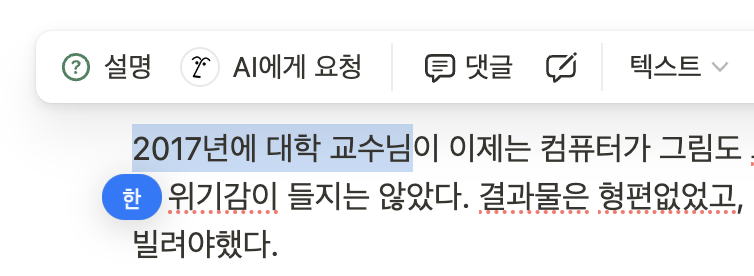
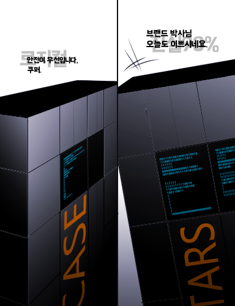

## 개요

지난 1~2년 사이 AI의 발전은 놀라웠고, 우리 삶의 많은 부분을 바꾸어놨다.

  
_출처: [위키피디아: DeepDream](https://en.wikipedia.org/wiki/DeepDream)_

2017년에 대학 교수님이 “이제는 컴퓨터가 그림도 그린다”며 위 이미지를 보여주셨던 것이 기억난다. 당시에는 딱히 위기감이 들지 않았다. 결과물은 형편없었고, 이미지가 필요하면 내가 직접 그리거나 그림을 잘 그리는 사람의 도움을 받아야 했다.

그 뒤로 GPT라는 거대한 모델의 등장과 함께 AI는 급격하게 발전했고, 순식간에 캐즘을 뛰어넘었다. 이제는 돈을 주고 이용할 만큼 꽤 그럴싸한 그림을 만들어내고 있다.

그렇다. AI는 이제 우리 곁으로 다가왔고, 우리 개발자들은 AI를 이용한 서비스를 제공해야 한다. 이 글에서는 AI의 등장으로 서비스들이 어떤 변화를 겪고 있는지, 그리고 프론트엔드(FE) 개발자들에게 어떤 역량이 중요해질지 예측해본다.

## AI의 등장으로 바뀐 서비스의 양자

AI는 게임 체인저이다. 게임 체인저는 시장의 판도를 바꿀 만큼 기존의 다른 제품들보다 압도적으로 좋기 때문에, 따라가지 못하면 도태된다. OpenAI가 주도하는 이 시장에 돈이 쏟아지고 있으며, 시장의 변화에 따라 우리가 만드는 서비스의 양상도 완전히 달라졌다.

### AI 보조(Assistant)

  
_출처: [Canva의 Magic Media](https://www.canva.com/ai-image-generator/)_  
  
_출처: 글쓴이의 notion_

기존 서비스들은 AI를 위한 메뉴(AI Assistant)를 추가하는 식으로 AI를 접목시켰다. 기존의 서비스 구조에 AI를 접목하는 것은 메뉴를 하나 빼서 추가하는 게 가장 빠른 방법이었을 것이다.

AI 보조는 기존에 서비스에서 할 수 있던 것들을 더 편하게 혹은 더 잘할 수 있게 도와준다. 이들은 **생성의 주체가 아니라 보조이다.**

Notion은 초기엔 생성의 주체로 AI를 도입했다. 주로 글을 생성해주는 기능이었는데, 욕을 많이 먹었다. AI가 유저가 원하는 것을 생성해주지 않았기 때문이다. 노션에서도 이를 인식하고 AI를 완전히 재설계했다. ([노션 블로그 참고](https://www.notion.so/blog/notion-ai-is-here-for-everyone)) 지금은 유저가 글을 작성하고 맞춤법을 수정하거나 관련된 문서를 찾고 요약하는 등, 유저의 행동에 더욱 필요한 도움을 주는 방향으로 AI를 사용하고 있다.

### AI 도구(Tool)

AI가 생성의 주체인 서비스들도 존재한다. AI로 인해 그전에는 꿈에도 꾸지 못하던 콘텐츠 생성이 가능해졌고, 도구의 형태로 AI를 지원하는 서비스들이 대량으로 등장했다. 이미지를 생성하는 Midjourney, Flux를 비롯해 교육, 번역, 코딩 등 다양한 분야에 AI를 접목할 수 있게 되면서, 그와 관련된 도구들이 만들어지고 있다.

AI 도구들은 앞선 AI 보조와 달리 **AI 자체가 서비스이다.** 대체로 유저가 직접 생성하기 어려운 것들에 대해 생성을 위탁한다. 여기서 어려움이란 반복적인 노가다성 작업일 수도 있고, 음성이나 이미지처럼 고급 스킬이 필요한 작업일 수도 있다.

  
_출처: [Flux](https://flux-ai.io/flux-ai-image-generator/)_

AI 도구의 특징은 **UI가 아주 단순하다**는 것이다. 더 이상 이미지를 만들어내기 위해 포토샵의 복잡한 도구들과 레이어, 픽셀 유동화 등의 개념을 이해할 필요가 없다. 그저 원하는 것을 잘 설명하는 것만으로 충분하다.

## 프론트엔드 개발자는 어떻게 바뀔 것인가?

### 더욱 인간스럽게

  
_출처: [익스트림무비](https://extmovie.com/movietalk/5790977)_

Notion AI에서 인터랙티브한 AI의 형상을 배치했듯, 보조가 된 AI는 점차 ‘불쾌한 골짜기’를 줄여가며 자비스, 타스와 가까워질 것으로 기대된다. 반대로 말하면, 프론트엔드 개발자들은 그만큼 인터랙션을 깎고 다듬어야 할 것이다.

이에 따라 CSS, JS를 활용한 인터랙티브한 애니메이션 기술을 잘 다루는 것이 기대된다.

### 직관적인 UI

앞서 Flux에서도 보았고, ChatGPT를 써보았다면 알겠지만, AI는 복잡한 사용법을 요구하지 않는다. 필요한 것은 한 줄의 프롬프트 입력창뿐이다. 유저가 궁극적으로 원하는 것도 **딸깍** 한 번이면 원하는 것을 생성하는 것이다.

긍정적으로 AI가 더욱 발전한다고 가정할 때, 우리는 궁극적으로 유저에게 딱 한 가지만 제공하면 될 것이다. 바로 ‘AI와 대화할 수 있는 수단’이다. 메뉴도 만들 필요 없고, 유저가 다음 행동을 하도록 유도하는 복잡한 가이드도 필요 없을 것이다. 유저는 더 이상 학습할 필요가 없다.

이에 따라 프론트엔드에서는 실시간으로 소통하고 부드럽게 화면에 전달할 수 있는 기술이 중요해질 것으로 보인다. 스트리밍, 실시간 통신 기술 등의 네트워크 역량도 필요해질 것 같다.

### 에디터

AI의 발전이 한계에 도달한다고 예측한다면, AI가 하지 못하는 부분을 유저가 채우는 방식으로 서비스가 진화할 것이다. 그 말은 결국, 원하는 부분을 채우기 위해 유저가 조작하고 다룰 수 있는 에디터가 필요해진다는 뜻이다. 물론 AI의 발전 과도기에도 에디터는 필요할 것 같다.

에디터는 클라이언트에서 구동되는 복잡한 인터랙션과 성능이 중요하기 때문에, UI에 대한 심도 있는 이해와 구현력, 최적화, 혹은 WASM 같은 프론트엔드의 고난이도 기술 및 신기술들을 다룰 수 있어야 할 것으로 보인다.
