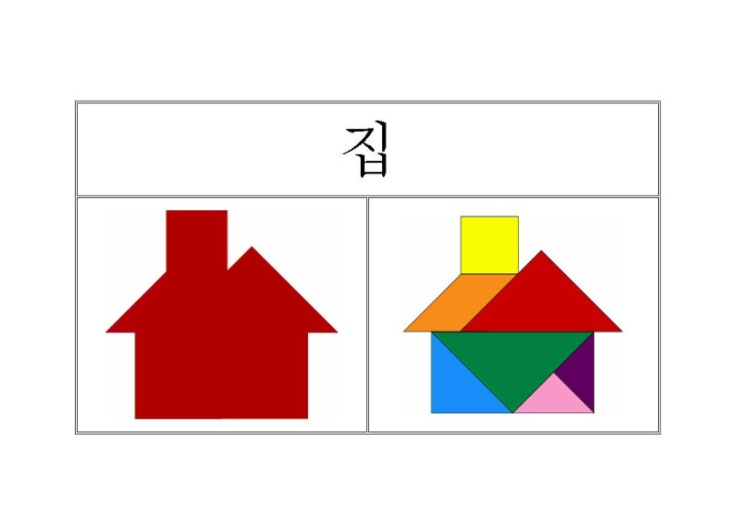
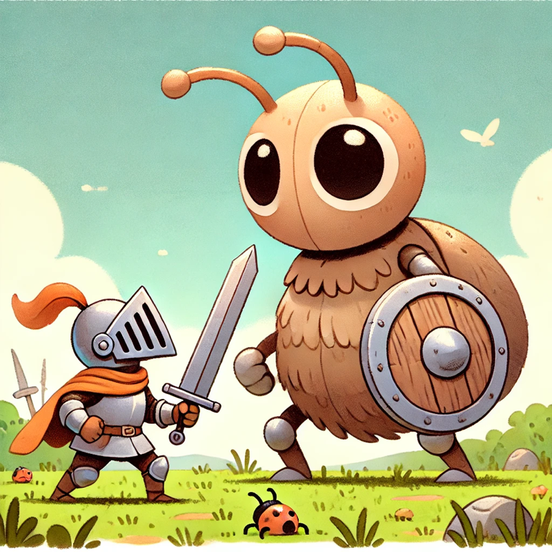
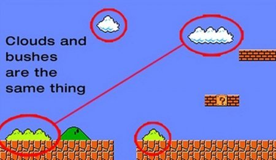
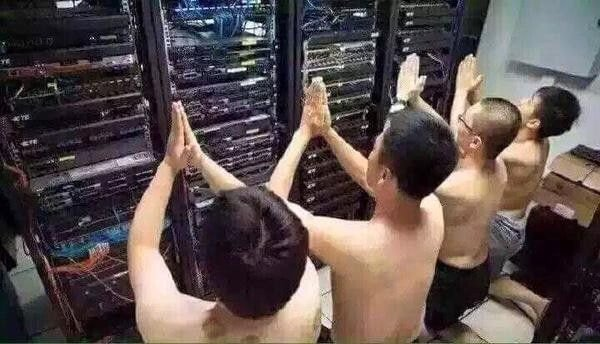

## 개발자와의 대화는 어렵다?

최근 PM을 포함한 다양한 비개발자들이 개발자와의 대화에서 비슷한 어려움을 겪는다는 것을 발견했다.

> ???: 개발자는 안된다는 말을 1시간 동안 빙빙 돌려서 말해요.
> ???: 왜 자꾸 안된다고 하나요?

개발자인 입장에선 아마 안되니까 안된다고 했을 것 같다. 개발자는 개발자대로 안되는 이유를 열과 성을 다해 설명했을 것이다. 하지만 비개발자인 당신이 듣기에는 그것들이 외계어와 다를 바 없다.

당연히 비개발자인 당신이 그 외계어를 듣고 이해할 필요는 없다. 하지만 끝내 안된다고 말했을 때 "안되는구나" 하고 대화를 끝내면, 곧 비슷한 다른 상황에서 같은 대화를 반복하게 될 것이다.

왜 안된다는 설명이 1시간이나 걸려야 했던 걸까? 개발자가 말하는 ‘안된다’는 무슨 의미일까? 애초에 요구사항이 들어오면 개발자들은 무얼 하는 걸까? 지금부터 가상인물 D 씨의 이야기를 통해 개발자들은 무엇을 하는지, 왜 안된다고 하는지 비유를 통해 쉽게 이해해 보자.

## 개발자는 뭘 하는 사람인가요?

개발자 D(Developer) 씨는 서버면 서버, 클라이언트면 클라이언트 못하는 게 없는 슈퍼 개발자이다. (우리는 종종 이런 개발자를 유니콘이라고 부른다.)

D 씨는 일요일 오후 햇빛을 피해 카페 구석에서 그의 노트북을 두드리고 있다. 그가 하는 일은 모르는 사람이 보면 하루 종일 컴퓨터를 붙잡고 어두운 화면에 알록달록한 글자들을 빼곡히 써 넣는 일일 것이다. 조금 아는 사람은 코딩(Coding)을 하는구나!라고 알아볼 것이다. 개발자들은 그가 형상 관리, 유지보수, 모듈화, 추상화, 리팩토링 등등의 작업을 하고 있음을 알아챌 것이다.

앞에서 복잡하게 설명했지만, 결국 개발자가 하는 일은 **세계관을 만들고 관리하는 일**이다. 조금 거창해 보이지만 이런 식의 일이다.

> ‘사과’는 빨갛고 둥근 과일이에요.  
> ‘오렌지’는 주황색에 크고 둥근 시큼한 과일이에요.  
> ‘사과’와 ‘오렌지’는 달라요.

이는 절대적이지 않고 개발자마다 다른 정의를 만든다. 누군가는 사과를 둥글다고 하지만 누군가는 사과는 둥글지 않다고 한다. 그것이 사실인지는 중요하지 않다. 중요한 것은 “A는 B하다”와 같은 논리 관계를 만들었으며 이것은 컴퓨터가 이해할 수 있다는 것이다.

### 개발자의 일: 요구사항 분석 & 설계하기

예를 들어보자, 당신은 세상에 존재하지 않던 ‘지구앱’에 대한 아이디어를 떠올렸다. 당신은 이 앱을 만들기 위해 개발자 D 씨를 찾아갔다.

> “지구앱을 만들어주세요!”

D 씨는 필히 당신에게 이렇게 되묻는다.

> “지구앱은 무엇입니까?”

당신은 이렇게 설명한다.

> “지구앱은 가상의 지구에요. 땅과 바다가 있고 각종 생물들이 살고 있어요. 모든 생물은 생존하기 위해 에너지를 얻는 행위를 합니다. 이게 있으면 과학자들이 연구하는 데 큰 도움이 될 거예요.”

이를 들은 D 씨는 흥미를 보이며 질문을 이어나간다.

> 생물은 몇 종류가 있을 수 있죠? 땅의 너비와 바다의 부피는? 에너지는 무한한가요?

_개발은 사실 칠교놀이다?_

개발자에게 요구사항은 마치 칠교놀이와 같다. PM이 집 모양 판을 가져왔다면 그 집을 어떤 블록으로 어떻게 채울 수 있을지 고민한다. 때문에 질문도 발산적이기보단 뭐가 되고 뭐가 안 되는지, 어디까지가 경계인지를 묻는 수렴적 질문이 대부분이다.

질문을 마치면 개발자는 당신의 요청을 바탕으로 필요한 칠교 조각을 모아 판을 채울 최적의 해법을 구한다. 다양한 해법들의 장단점을 고려하여 하나의 해법을 고르면 비로소 구현에 들어간다.

이 단계에서도 안된다는 말이 나올 수 있다. 흔히 블루투스 샤워기라고 부르는 경우이다. 너무 유명하기 때문에 이는 자세히 다루지 않겠다.

### 개발자의 일: 구현하기

요구사항이 명확해진 개발자 D 씨는 두뇌를 풀가동해 천지창조(앱 만들기)를 시작했다. 먼저 ‘빛’을 정의한다.

> 빛은
>
> 1. 에너지를 갖는다.
> 2. 광속으로 이동한다.
>
> - 빛이 있으면 하늘이 밝아진다. 빛이 없으면 하늘이 어두워진다.

다음으로 ‘바다’와 ‘땅’을 구현한다.

> 바다는 물로 이루어졌다.
> 땅은 흙으로 이루어졌다.
> 식물은 흙 위에서 자란다. 식물은 빛을 받으면 에너지로 저장한다.
> 동물은 식물을 섭취하거나 동물을 섭취할 수 있다.

…
각 개념은 특성(빛은 에너지를 갖는다)과 상호작용(식물은 빛을 받으면 에너지로 저장한다)을 갖는다. 또한 앞선 개념들을 구현하기 위해 에너지, 물, 흙과 같은 새로운 개념과 물리법칙이 필요해졌다. 이렇게 위에서부터 필요한 개념들을 차근차근 설계해 간다. 반대로 원자부터 정의해서 점점 요구사항까지 조합해 가기도 한다. 뭐가 됐든 요구사항이 구현되기 위해서 유저에게 가장 가까운 화면에서부터 수십, 수백 개의 톱니가 맞물려 돌아가는 복잡한 내부까지의 긴 간극을 채워야 한다.

(엄밀히 말해 이는 객체지향 패러다임에 가깝고 구현 방식 중 하나일 뿐이다. 하지만 일단은 이렇게만 이해해도 충분하다.)

_설계를 마쳤으면 컴퓨터에게 알려줘야 한다._

설계를 마쳤으면 컴퓨터에게 알려줘야 한다.

정의를 마쳤다면 그대로 컴퓨터에게 정의를 이해시켜야 한다. 컴퓨터는 그다지 스마트하지 않기 때문에 앞서 추상화한 대로 설명하면 전혀 알아듣지 못한다. 실제 컴퓨터에게 알려주는 과정은 위 짤과 같이 아주 기본부터 설명하는 과정이며 이것을 ‘코딩'이라고 부른다.

여기선 모든 것을 설계한 뒤 구현을 하는 것처럼 말했지만 실제론 작은 설계와 구현이 끊임없이 반복되는 형태로 진행된다. 모든 것을 설계하고 작업하기엔 인간의 뇌에 다소 한계가 있다.

### 개발자의 일: 버그 고치기

개발자 D 씨는 6일간 열심히 앱을 만들었고 일요일은 쉬었다.(야근한 게 맞다) 당신은 D 씨가 완벽한 앱을 만들었다고 생각하고 앱을 팔기 시작했다. 하지만 곧 무수한 버그를 마주한다.

1. 금붕어에 입과 위를 달고 섭취하는 기능을 추가했다. 하지만 배부르다는 개념을 깜빡해 붕어는 배가 터질 때까지 식사를 멈추지 않았다.
2. 인간을 개발하다가 미리 만들어둔 맹장은 요구사항 변경에 따라 불필요해져 버렸다. 그리고 이는 맹장염을 일으키기 시작했다.
3. 개복치는 시간이 없어서 만들다 말았다. 대충 봉합해서 마무리했다. (이건 버그는 아닌가?)
4. 어느 날 키위새가 멸종해버렸다. 왜인지는 아직도 모른다.

_개복치는 만두같이 생긴 것 같다._

개복치는 만두같이 생긴 것 같다.

버그는 인간이 불완전하기 때문에 필연적으로 발생한다. 주로 논리 오류로 인해 생긴다.

> ‘a는 1보다 크다’의 반대말은 무엇인가요?

누군가 이렇게 물어보면 대부분의 사람은 ‘a는 1보다 작다’라고 답할 것이다. 하지만 수학적으로 ‘a는 1보다 크다’의 반대말은 ‘a는 1보다 크지 않다’이다. 실제로 ‘a는 1보다 작다’라는 논리 구조를 대입하면 `a = 1`인 경우 논리에 구멍이 생긴다. 이렇듯, 앞서 정의한 규칙들을 대입하다 보면 생각 못 한 논리적 구멍 혹은 오류들이 생긴다. 이것들이 나비효과를 일으키고 전혀 생각지도 못한 동작을 유발한다.

개발자는 잘못된 논리를 발견할 때마다 수정하고, 부족한 논리를 보충한다. 아예 잘못 설계되어 다시 부수고 새로 만들기도 한다만, 이미 서비스는 달리는 기차가 되었다. 달리는 기차의 바퀴를 교체하는 일은 어려운 일이다.

## 개발자는 왜 안된다고 하나요?

앞서 개발자의 일은 세계관을 만들고 관리하는 일이라고 했다. 그렇다면 안된다고 하는 이유는 이 **세계관이 부서지기 때문**이다. D씨의 이야기를 이어가 보자.

### 기능 추가가 오래 걸리는 이유

지구앱을 고치고 고쳐 어느 정도 그럴싸하게 굴러가는 앱이 되었다. 앱은 적당히 팔리기 시작했고 소비자들로부터 각양각색의 목소리가 나오기 시작했다. 당신은 이를 통해 새로운 요구 사항들을 발견하기 시작했고 그것은 곧 D씨의 일이 되었다.

> “이번 정기 배포엔 ‘달’을 추가하죠. 유저들이 달을 추가해 달라고 아우성이에요.”

D씨는 당신의 부탁을 흔쾌히 수락하지 못한다. 앱의 설계에 우주는 전혀 고려되지 않고 있다. 우주는 며칠 작업해서 추가할 수 있을 만큼 단순한 개념이 아니다. ‘달’을 추가하기 위해선 설계를 크게 변경해야 했고, 이는 다시 여러 개의 규칙을 파괴하게 된다. D씨는 순간 안된다고 말할지 고민하다가 달을 추가하는 것이 가능한지 확인하고 얼마나 시간이 걸릴지도 알아보겠다고 한다. 당신에겐 하늘에 둥근 원하나 추가하고 움직이게만 하면 되는 것으로 보이지만, D씨의 세상은 대격변을 준비해야 한다.

D씨는 가정을 하나씩 점검하기 시작한다.

- 달 추가 시 영향을 받는 것들
  - 바다
    - 만유인력의 개념이 추가된다. 밀물과 썰물이 생긴다.
    - 이에 따라 생물들도 영향을 받는다.
  - 밤
    - 밤이 되면 어두워진다는 개념을 수정해야 한다. 밤이 되어도 달로 인해 일정 이상의 밝기를 유지해야 한다.
    - 구름에 가려질 수 있으며 이때 밝기가 감소한다.
  - 달이 위치하기 위해 우주의 개념이 추가된다.
    - 공전과 자전의 개념이 추가된다.

…

_보이는 것만큼 단순하지 않다_

이처럼 추가된 요구 사항을 만족하기 위해선 단순히 보이는 것 외에 보이지 않는 복잡한 뒷세계의 규칙들까지 모두 만족시켜야 한다. 따라서 논리 구조도 다시 설계가 필요해지는데, 운이 없다면 작은 기능 하나를 위해 큰 시간을 들여 많은 것들을 재설계해야 한다. 그렇게 갈아엎은 논리 구조는 다시 구멍이 뚫릴 가능성을 갖게 되고, 이는 제품의 안정성 저하로 이어진다. 때문에 개발자는 동시에 많은 것들을 고려해야 하고 그 기능이 온전히 추가될 수 있음을 확인해야 한다. 앱이 크고 복잡할수록, 즉 더 많은 논리 규칙을 내포할수록 새 기능을 추가하는 데 더 오랜 시간을 쓰게 된다.

물론 요구에 따라 빠른 개발을 해야 할 때도 있다. 목표를 위해 속도를 내야 하기 때문에 쉬운 꼼수를 쓰기도 한다. 가령 ‘덤불’을 만들어 달라고 했을 때 ‘덤불’ = ‘초록색 구름’과 같이 정의하고 구현을 마친다. 이런 방법은 때로는 좋은 꼼수이지만 다른 요구 사항이 추가됐을 때 그 요구 사항의 발목을 잡는 논리가 되기도 한다.

_슈퍼마리오의 덤불은 구름을 가져와 색만 바꾼 것이다._

### 기능 추가를 거부하는 이유

시간이 흘러 당신은 더 많은 기능을 시뮬레이터에 추가했고 많은 사람들의 사랑을 받는 제품이 되었다. 하지만 당신의 오랜 파트너인 D에 대한 신뢰가 조금씩 흔들리기 시작했다. 멋진 신규 기능 추가를 얘기하면 D씨는 한숨부터 쉰다. 그리고 이건 이렇고 저건 저렇고 미주알고주알 길게 설명을 한다. 길게 설명했지만 결국 안된다는 말이다. 뿔 달린 소도 있는데 뿔 달린 말은 왜 안된다는 말인가?

_처음엔 분명 도마뱀이었을 것이다. 아니 뱀이었으려나?_

D씨의 입장도 들어보자. D씨는 그간 공들여 만든 앱이 예전 같지 않다. 아니 더 이상 지구앱이라고 부를 수 있을지 모르겠다. 앱은 이제 너무 많은 동식물과 물리법칙으로 복잡해져서 몇 만 줄이 넘는 코드로 삐그덕거리며 굴러가고 있다. 문제는 진작에 앱에 대한 통제력을 잃었다는 점이다. 이제 점점 엉뚱한 곳에서 버그가 터지기 시작했고 문제를 해결하려면 몇 만 줄의 코드를 한참 들여다봐야 한다. 여기에 유니콘까지 만들라고? 유니콘이 일으킬 버그들에 벌써 머리가 아프다. D씨는 점점 앱을 파괴하고 다시 만들고 싶은 욕구가 생긴다. 대홍수를 일으키고 처음부터 다시 시작하는 상상을 한다. 처음엔 분명 모든 게 완벽했는데 말이다.

초기 단순했던 제품은 비즈니스 요구 사항이 늘어가며 점차 비대해진다. 이는 엔트로피의 증가를 의미한다. 작은 기능 추가에도 전체 논리 흐름에 구멍이 송송 난다. 때문에 개발자들은 제품을 컨트롤할 능력을 잃고 변화를 두려워하게 되는데, 이런 개발자들은 점점 배포 전 기도를 올리거나 아무튼 안된다고 하는 방어주의자가 된다.

_근데 나도 왜 이런 짤이 존재하는지는 모르겠다._

## 개발자들이 안된다고 하는 3가지 이유

D씨의 이야기는 여기까지다. 이제 개발자가 안된다는 말을 왜 그렇게 길게 하는지 이해할 수 있을 것이다. 다음과 같은 케이스가 있을 것이다.

1. 당신이 가져온 칠교는 말도안되는 형태이다. (기술적 한계로 불가능함)
2. 당신의 요구 사항이 개발자가 창조한 세계에 큰 변경을 일으킨다. (요구 사항의 이점보다 비용이 크다)
3. 당신의 요구 사항이 서비스의 엔트로피를 증가시킨다. (앱의 안정성을 해친다)

다시 말하지만 개발자는 개발자 나름대로 노력하여 친절하게 설명했을 것이다.

## 개발자들이 안된다고 하지만…

앞선 D씨의 이야기는 살짝의 과장이 있다. 인간은 과거의 실수를 토대로 성장하는 법. 현대에는 앱을 더 잘 만드는 방법, 즉 소프트웨어 공학이 발전하고 있고 앞선 D씨의 이야기처럼 제품의 통제력을 잃는 일을 줄여나가고 있다. 실제로 세상의 많은 크고 오래된 제품들이 이미 잘 굴러가고 있지 않던가?

개발자도, 디자이너도, PM도, 우리는 모두 유저의 문제를 푸는 해결사이자 메이커이다. 우린 모두 같은 목표를 위해 노력하고 있다. 다만 그 목표를 이루기 위해 서로 포기할 수 없는 영역이 생길 뿐이다. 때로는 개발자가 안된다고 말해도 낙담하지 않았으면 한다. 분명 모두가 윈-윈할 수 있는 이상적인 솔루션이 있을 것이고, 개발자 또한 그것을 바라고 있을 것이다.
