## Oklch를 써야 한다고?

우리가 웹에서 색을 표현하는 방법은 여러 가지가 있다. 전통적인 `rgb` 와 우리가 너무 흔히 아는 hex 표기법(`#FF0000`), 이후 CSS3에서 추가된 `hsl`까지.

이걸로 충분하지 않나 싶은데, 최근(2023년) CSS Color Level 4에 `lch`, `lab`, `oklch`등의 함수가 대거 포함되었고 최근 웹 트랜드는 이제 `rgb`말고 `oklch`를 사용해야한다고 말하고 있다.

누군가는 "또 뭐가 나왔네..."하고 한숨부터 쉴 수 있겠지만, 사실 이것들은 알고 보면 별거 없다. 그래서 이번 글에선 '왜 oklch를 써야 하는가?'라는 질문에 답하기 위해, 가장 근원적인 질문에서부터 이야기를 시작해 보자.

## 인간은 색을 어떻게 인지하는가?

안 궁금할 수 있지만 생물 시간을 조금 갖겠다. 이 질문은 우리가 사용하는 모든 색 표기의 핵심이기에 꼭 짚고 가야 한다. 바로 **인간은 색을 어떻게 인지하는가?** 이다.

### 삼원색 이론 - 눈이 색을 인식하는 방법

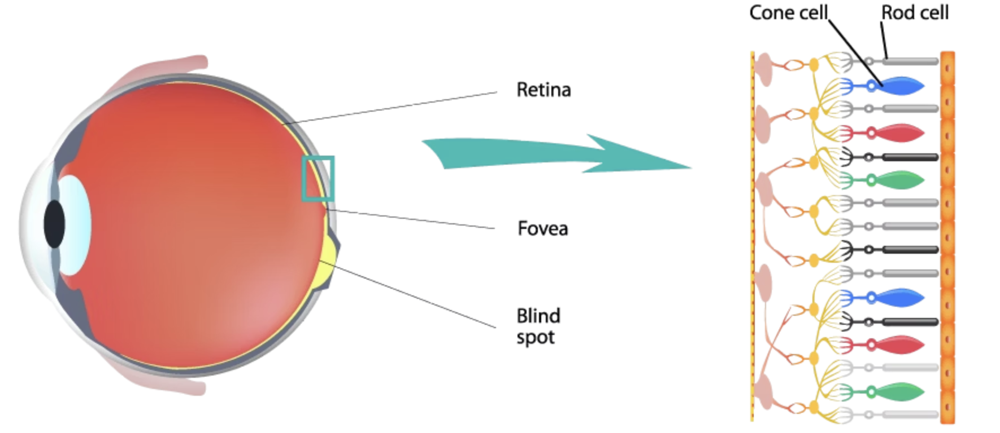
_간상세포와 원추세포, [출처: benq - what is accurate color](https://www.benq.com/ko-kr/knowledge-center/knowledge/what-is-accurate-color.html)_

인간은 눈에는 빛을 감지하는 세포가 두 종류 있다. 먼저 빛의 양에 반응해 명암을 구분하는 간상세포(rod cell), 가시광선에 반응하여 색을 구분하는 원추세포(cone cell)이다.

원추세포는 3종류가 존재하는데 다음과 같다.

- 🔴 L(Long)원추세포 - 긴 파장(빨간색)에 민감하게 반응한다.
- 🟢 M(Medium)원추세포 - 중간 파장(초록색)에 민감하게 반응한다.
- 🔵 S(Short)원추세포 - 짧은 파장(파란색)에 민감하게 반응한다.
  (사실 사람에 따라 4종류인 경우도 있지만 몰라도 된다)

이 3가지 원추세포가 반응하는 것에 따라 우리가 보는 색이 결정된다는 이론이 바로 [**영-헬름홀츠 색각설**(삼원색 이론)](https://ko.wikipedia.org/wiki/%EC%98%81-%ED%97%AC%EB%A6%84%ED%99%80%EC%B8%A0_%EC%83%89%EA%B0%81%EC%84%A4)이다.

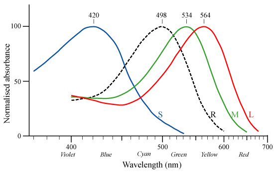
_빛에 대한 시세포의 반응, 출처: [위키백과 - 원추세포](https://ko.wikipedia.org/wiki/%EC%9B%90%EC%B6%94%EC%84%B8%ED%8F%AC)_

이후 `oklch`의 이해를 위해 조금만 더 깊이 들어가보겠다. 이 세 원추 세포는 사실 정확하게 빨강, 초록, 파랑에서 가장 강하게 반응하지 않는다.(그래프 참고) 특히 L 원추세포는 노란색 근처에서 가장 강하게 반응한다.

이러한 세포의 특징 때문에 노란빛에서 L, M 원추세포가 모두 강하게 활성화 되면서 **우리는 파랑보다 노랑을 밝게 느낀다.**

### 반대색 이론 - 뇌가 색을 인지하는 방법

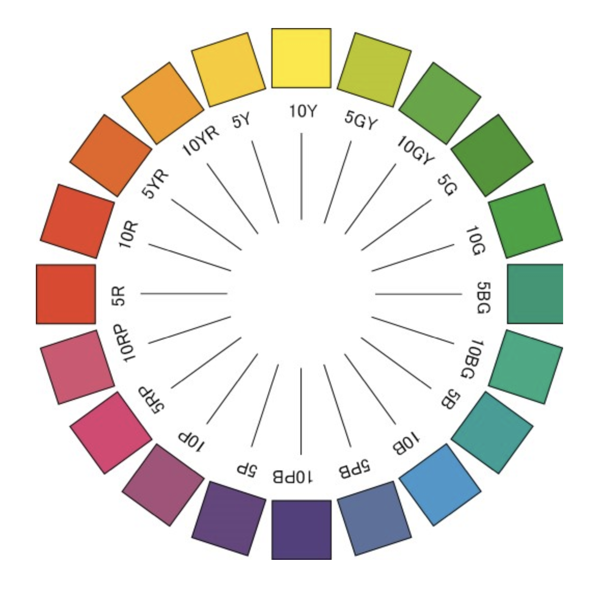
_출처: [컬러리스트를 위한! 영헬름홀츠, 헤링, 먼셀 표색계에 대해 알아보자](https://m.blog.naver.com/dwencpr/140157450063)_

색인지를 설명하는 하나의 이론이 더 있다. 바로 [헤링의 색각이론반대색설(반대색 이론)](https://www.healthline.com/health/opponent-process-theory#:~:text=The%20opponent%20process%20theory%20proposes,Hering%20in%20the%20late%201800s.)이다. 이에 따르면 서로 반대되는 색끼리 짝을 지어 **'하나의 채널'** 로 만든다.

- 🔵 **파랑** vs 🟡 **노랑** 채널
- 🔴 **빨강** vs 🟢 **초록** 채널
- ⚫ **검정(어둠)** vs ⚪ **하양(밝음)** 채널

이 채널은 동시에 한 가지 색만 전달한다. 예를 들면 우리 눈은 빨강과 노랑 사이의 주황, 초록과 파랑 사이의 청록은 인식할 수 있지만, 적색이면서 녹색인 색은 볼 수 없다.

반대색 이론은 삼원색 이론을 부정하며 나온 이론으로 서로 모순된다고 여겼지만, 현대에는 이 두 이론을 모두 받아들여 인간이 L,M,S 세포로 색을 받아들이고 인간의 뇌가 이를 해석해 최종적으로 색을 인지하는 과정을 거친다고 설명한다.

## 색을 어떻게 가리킬 것인가?

이제 다음 질문으로 넘어가자. 당신과 내가 정확하게 같은 색을 가리키려면 어떻게 해야 할까?

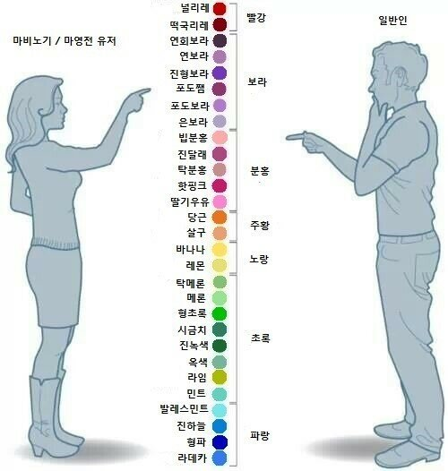
_같은 색을 다르게 볼 수 있게 된 마비노기 유저. [출처: 더쿠 - 캠프파이어하러 깔았다가 색덕후가 되는 게임.jpg](https://theqoo.net/square/1137126783)_

색은 아주 다양하다. 우리가 아는 빨강 안에서도 밝은 빨강, 어두운 빨강, 진한 빨강, 연한 빨강 등등 나눈다면 얼마든지 나눌 수 있다. 따라서 우리가 동일한 빨간색을 가리키기 위해선 얼마큼 어두운지, 얼마큼 진한지와 같은 좌표가 필요하다. 이것이 바로 **색 공간(Color Space)** 이다.

## RGB 색 공간

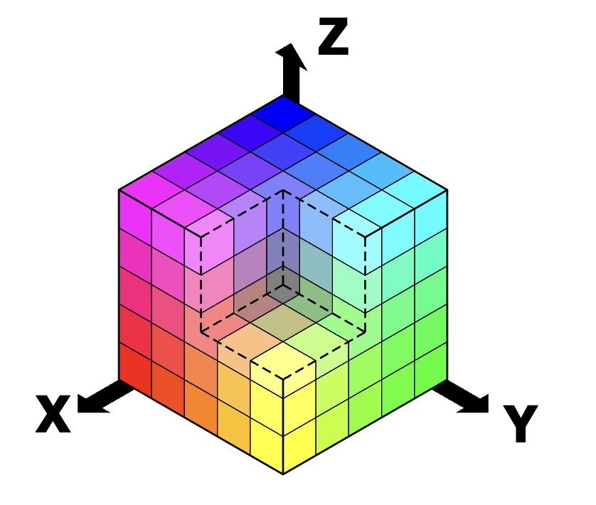
_sRGB 색 공간, r,g,b 세 개의 축을 사용한다._

앞서 설명한 '삼원색 이론'을 수치화하여 컴퓨터에서 사용할 수 있게 한 것이 바로 **sRGB** 색 공간이다.

sRGB는 R,G,B 세 빛을 얼만큼 섞을지로 색을 표현한다. 각 빛의 양은 빛이 전혀 없는 0에서 빛이 가장 강한 255까지 1Byte 안에서 표현할 수 있다.

```css
.red {
  color: rgb(255 0 0);
  /* = #FF0000 */
  /* 가장 밝은 빨간빛, 가장 어두운 초록빛, 가장 어두운 파란빛을 섞었다. */
  /* 당연히 빨간색이 될 것이다. */
}
.green {
  color: rgb(0 255 0);
  /* = #00FF00 */
}
.blue {
  color: rgb(0 0 255);
  /* = #0000FF */
}
.yellow {
  color: rgb(255 255 0);
  /* = #FFFF00 */
  /* 빨간색 빛과 초록색 빛을 비추면 노란 빛이 된다. */
}
.cyan {
  color: rgb(0 255 255);
  /* = #00FFFF */
}
```

이 방식에서 명도를 조절하려면 빛의 양을 줄이면 된다.

```css
/* 순수한 빨강 */
.red-high-lightness {
  color: rgb(255 0 0);
}

/* 좀 더 어두운 빨강 */
.red-low-lightness {
  color: rgb(130 0 0);
}
```

채도를 조절하기 위해선 색 간의 편차를 줄이면 된다. (즉 회색에 가깝게 만든다)

```css
/* 순수한 빨강 (채도 100%) */
.pure-red {
  color: rgb(255 0 0);
}

/* G와 B에 빛을 똑같이 섞어 탁한 빨강이 되었다 */
.dull-red {
  color: rgb(255 128 128);
}
```

### RGB의 한계

꽤 괜찮은 방법 같지만, 이 방식은 한계가 있다.

우선 앞서 설명한 명도와 채도를 조절하는 과정이 **인간에게 직관적이지 않다.** 예를 들어보자. 버튼이 hover 되면 버튼을 조금 더 어둡게/밝게 만드는 것은 흔히 볼 수 있다. 버튼의 색이 `rgb(50, 100, 200)` 라고 할 때 '10% 더 어둡게'하고 싶다면 값을 어떻게 바꿔야 하는가? 정답은 `rgb(40, 80, 159)` 이다. 단순히 10%씩 각 색의 양을 감소시킨다고 원하는 색이 나오지는 않는다.

둘째로 RGB는 실제 인간의 색 인지를 온전히 반영하지 않는다. 이 부분은 다음 파트에서 더 자세히 설명하겠다.

## HSL - RGB의 인지 개선

컴퓨터 그래픽스를 연구하던 사람들은 명도와 채도를 인간이 직접 조절하기 어렵다는 RGB 좌표계의 한계를 개선하기 위해 Hue(색), Saturation(채도), Lightness(명도)의 조합으로 RGB를 치환하는 시도를 한다. 그것이 바로 HSL 색 공간이다.


_HSL의 색 공간, [출처: HSV or HSL color space](https://www.psy.ritsumei.ac.jp/akitaoka/HSV_color_space.html)_
위 이미지에서 채도가 낮아지면 원뿔의 중앙으로 이동하게 되며, 두 원뿔의 양 끝으로 이동하면 명도가 높아진다.

RGB와 다르게 HSL가 원뿔 형태가 되는 것은 색상(Hue)을 RGB처럼 값이 아니라 각도로 나타내기 때문이다.

```css
.red {
  color: hsl(0deg 100% 50%);
}
.green {
  color: hsl(120deg 100% 50%);
}
.blue {
  color: hsl(240deg 100% 50%);
}
```

hsl에서 명도(l)의 기본값은 50%다. 이를 기준으로 더 밝은색은 퍼센트를 올리고, 더 어두운색은 퍼센트를 낮추면 된다.

```css
color: hsl(0deg, 100%, 50%) /* 가장 선명한 빨간색 */
color: hsl(0deg, 100%, 75%) /* 더 밝은 빨간색 */
color: hsl(0deg, 100%, 25%) /* 더 어두운 빨간색 */
```

채도(s)는 무채색이 0%, 가장 선명한 색이 100%이다.

```css
color: hsl(0deg, 0%, 50%) # 회색
color: hsl(0deg, 50%, 50%) # 칙칙한 빨강
color: hsl(0deg, 100%, 50%) # 진한 빨강
```

이제 색 표현이 훨씬 직관적으로 바뀌었다. 명도와 채도를 직접 조절할 수 있게 되었고, "10% 더 어둡게 해주세요." 라는 요구가 들어오면 l 값을 단순히 10%만큼 빼기만 하면 된다.

### HSL의 한계

하지만 HSL에도 단점은 있다. HSL에서 **L(Lightness) 값이 같다고 해서 모든 색이 동일한 밝기를 갖지는 않는다.**


앞서 삼원색 이론을 설명하며 인간이 색을 감지하는 세포(원추세포)가 상대적으로 노란색에 더 민감하다고 했다. 이 말은, 같은 밝기에도 인간은 노란색을 더 밝게 느끼고, 파랑, 빨간색을 상대적으로 더 어둡게 느낀다는 말이다.

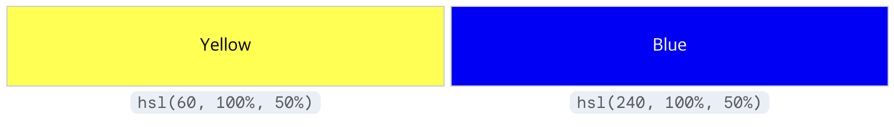
_노란색이 더 밝다._

RGB와 HSL에선 이러한 인간의 인지가 반영되어 있지 않다. 따라서 동일한 L 값이어도 사람이 느끼는 밝기는 노란 계열에서 더 밝게 느껴진다.

다음으로 Saturation(채도)에도 문제가 있다. 밝기가 너무 강하거나 너무 약하면 **채도가 의미 없을 정도로 차이 없어진다는 점**이다.
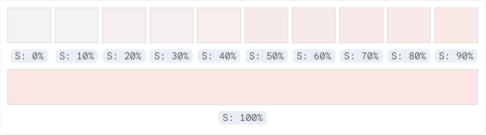
_10% 감소 정도로는 색의 변화가 거의 느껴지지 않는다._

이 문제는 'HSL가 RGB의 수학적 치환'이라는 점에 기원한다.

RGB의 정육면체 색 공간을 HSL로 치환하면 원뿔 두 개를 붙여놓은 모양의 색 공간이 된다. 명도가 높아지거나 낮아지면 원뿔의 끝점으로 이동하게 된다. 이 끝점에선 원뿔의 중앙과 밖까지의 거리가 아주 가깝다. 즉, 채도의 변경이 색의 변경에 거의 영향을 주지 않게 된다.

## CIEAB(Lab) - 인간의 인지에 더욱 가깝게

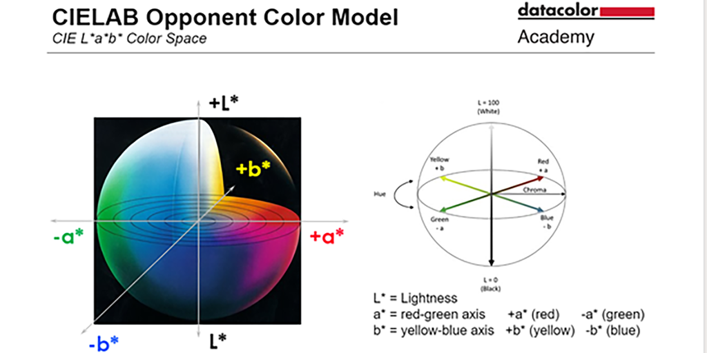
_CIELAB의 색 공간, 출처: [datacolor](https://www.datacolor.com/business-solutions/blog/what-is-cielab/)_
이후 등장한 CIEAB 혹은 Lab라고 부르는 색 공간은 **인지적 균일 색 공간(Perceptually Uniform Color Space)** 이다. 이 말은 Lab 공간 내에서 두 색상 간의 수학적 거리가, 사람이 실제로 느끼는 색상의 차이와 비례하도록 만들어졌음을 의미한다. Lab은 RGB, HSL가 인간의 인지를 반영하지 않는다는 문제를 해결하기 위해 **반대색 이론**을 기반으로 색 공간을 설계했다.

앞서 반대색 이론에서 인간은 빨강-초록, 노랑-파랑, 흰-검의 색 채널을 갖는다고 한 것을 기억해 보자. Lab은 이를 그대로 반영하여 좌표계를 구성한다.

먼저 L은 Lightness, 즉 명도이다. 흰-검 색 채널을 나타낸다. L=0은 빛이 없음, 즉 완전한 검정이다. L=100은 빛이 가득함, 즉 완전한 흰색이다. 다만 HSL의 L과는 다르게 **인지적 밝기**(인간이 느끼는 밝기)를 의미한다. 따라서 L 값이 동일하다면 모든 색의 밝기가 거의 동일하다.

a는 빨강-초록 채널로 얼마큼 빨갛고 얼마큼 녹색인지 구분하는 축이다. a가 양수(+)라면 빨간, 음수(-)라면 초록색을 의미한다.

b는 노랑-파랑 축으로 얼마큼 노랗고 얼마큼 파란지 구분하는 축이다. b가 양수(+)라면 노란색, 음수(-)라면 파란색을 의미한다.

이 두 값은 0값을 기준으로 무한히 커지거나 작아질 수 있지만 기기가 표현할 수 있는 색 영역(gamut)의 한계로 인해 실제로는 쓸 수 있는 값의 최대/최소 제한이 생긴다. 웹에서는 -125 ~ 125를 거의 min, max로 둔다. (거의라고 표현한 것은, 실제로는 -160 ~ 160까지도 쓸 수는 있기 때문)

```css
.red {
  color: lab(53.24% 80.09 67.2);
  /* = #FF0000 */
  /* 명도 53.24%, a 80.09, b 67.2 */
}
.green {
  color: lab(87.73% -86.18 83.18);
  /* = #00FF00 */
}
.blue {
  color: lab(32.3% 79.19 -107.86);
  /* = #0000FF */
}
```

## LCH - HSL의 장점과 Lab를 결합

흠...인간의 인지와 가까워진 것은 좋은데, 다시 RGB와 같이 직관성이 떨어져 버렸다. "좀 더 선명하게" 혹은 "좀 더 어둡게" 같이 채도와 명도를 조절하는 것이 어려워졌고, a, b 값의 변화에 색이 어떻게 바뀔지 예측하는 것이 어려워졌다.

그래서 LCH가 등장한다. Lab을 인간이 다루기 쉽게 수학적으로 치환했다.

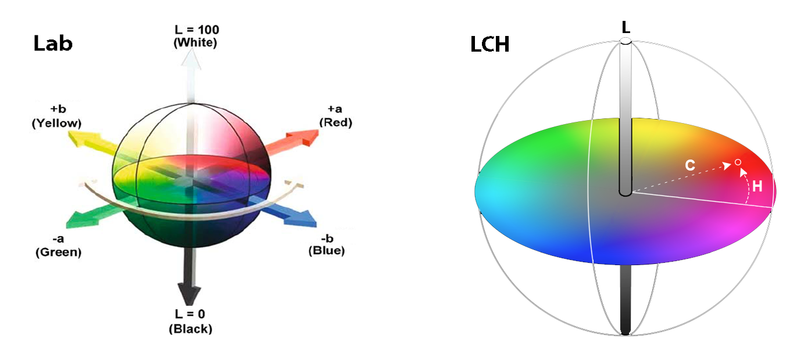
_오른쪽이 LCH의 색 공간. 출처: [Color Science Explained: Lab and LCH Color](https://kwalitylabels.com/color-science-explained-lab-and-lch-color/)_

LCH는 L(Lightness = 명도), C(Chroma = 채도), H(Hue)를 좌표로 사용하는 색 공간이다.

L은 Lab과 동일하다.

C는 0~150(이론상으론 무한히 커질 수 있음)으로 값이 클수록 색이 선명해진다.

H는 Hue로 HSL과 같이 각도(deg)로 색을 나타내는 값이다. 다만 HSL의 H와 동일하지는 않다. LCH의 H는 인지적 색상이다.

```css
.red {
  color: lch(54.29% 106.84 40.86);
  /* = #FF0000 */
  /* 명도 54.29%, 채도 80.09 색상 40.86deg(=red) */
}
.green {
  color: lch(87.82% 113.33 134.38);
  /* = #00FF00 */
}
.blue {
  color: lch(29.57% 131.2 301.36);
  /* = #0000FF */
}
.yellow {
  color: lch(97.61% 94.71 99.57);
  /* = #FFFF00 */
  /* 인간이 노란색을 가장 밝게 인지하기 때문에 lightness값도 가장 큰 것을 볼 수 있다. */
}
```

여기서 이상함을 감지한 사람이 있을 수 있다. 왜 L'C'H일까? HSL에선 Saturation, LCH에선 Chroma로 표기하고 있다. 둘 다 한글로는 채도이지만, 의미하는 것이 다르다.

먼저 HSL의 Saturation은 '회색에서 얼마나 멀리 떨어졌는지'를 나타내는 **상대적 비율(%)** 이다. 반면 LCH의 Chroma는 얼마나 선명한지를 나타내는 **절대적인 거릿값**이다.

HSL의 채도에 문제가 있었던 것을 기억하는가? Saturation은 비율이기 때문에 명도가 높거나 낮아져 원뿔의 꼭대기로 갈수록 비율로는 크게 차이가 나지만 실제 표현되는 색은 큰 차이가 없다는 문제가 있었다.

Chroma는 이와 절대적인 거릿값이기 때문에 Saturation과 달리 **Chroma 값의 변화가 항상 유의미**한 차이를 만든다.

그럼 이런 질문이 나올 수 있다.

> LCH의 색 공간도 구 형태이니, 위아래 끝(극점)은 폭이 좁아져 HSL과 같은 문제가 있지 않을까요?

핵심적인 차이는 이것이다. HSL은 그 좁은 공간에 0~100%의 채도 값을 억지로 매핑하여 값을 왜곡하지만, LCH에서는 그 좁은 공간에서 표현 가능한 **Chroma(채도)의 최댓값 자체가 매우 작아진다.** 따라서 HSL과 같이 값이 왜곡되지 않는다.

### LCH의 한계

LCH의 등장으로 색 공간은 거의 완벽에 가까워진 듯하다.

- RGB의 직관성이 떨어지는 문제가 해결됐다.
- RGB,HSL의 인간의 인지가 제대로 반영되지 않는 문제가 해결됐다.
- HSL의 채도가 왜곡되는 문제가 해결됐다.

하지만 애석하게도 여전히 한계가 있다. 바로 **색조가 모든 색 영역에서 균일하지 않다는 문제**이다. 대표적인 문제는 파란색의 채도와 명도 변경에서 보라색 계열이 나타나는 Blue Problem이다.
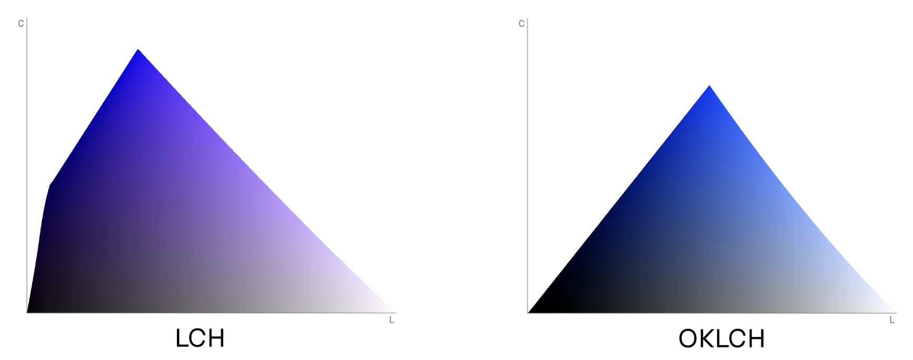
_파란색 이슈, 출처: [OKLCH in CSS: why we moved from RGB and HSL](https://evilmartians.com/chronicles/oklch-in-css-why-quit-rgb-hsl#:~:text=OKLCH%20vs.-,LCH,a%20constant%20hue%20as%20expected.&text=The%20Oklab%20and%20OKLCH%20spaces,using%20OKLCH%20for%20gamut%20mapping.)_

실제로 lch의 파란색 값을 가져와 보았다.
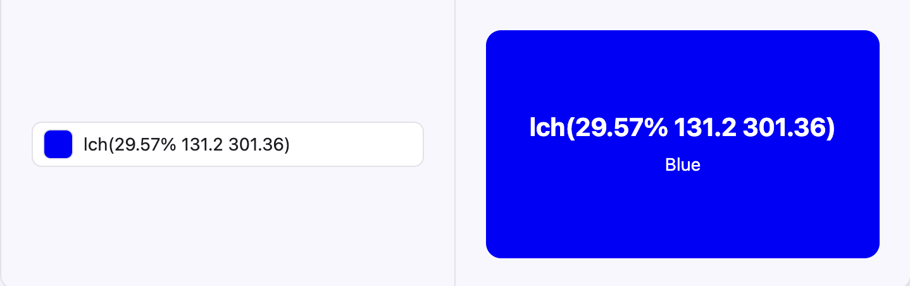
_rgb(0,0,255)의 파란색_
위 그림의 `lch(29.57% 131.2 301.36)` 은 rgb로 치환하면 `rgb(0 0 255)`로 완전히 파란색이다.
명도 20% 올려보겠다.
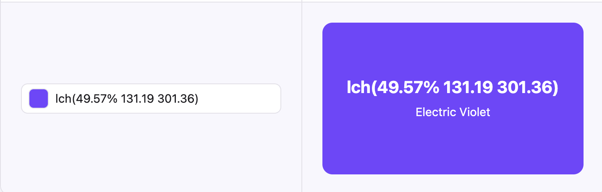
_명도를 올리니 Electric Violet 색이 되었다._
`lch(49.57% 131.19 301.36)` 은 `rgb(116, 69, 255)` 으로 보라색이다.

이번엔 채도를 50 낮춰보겠다.
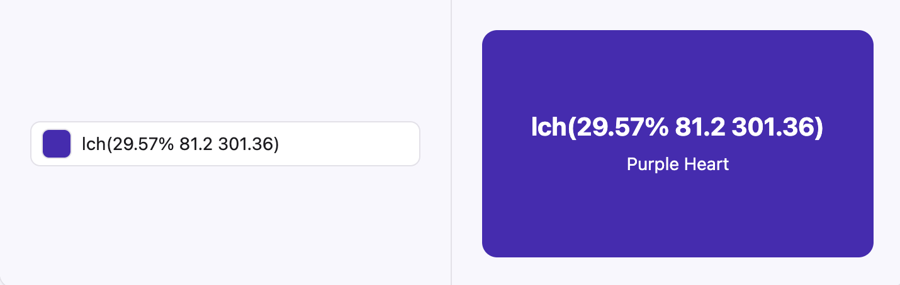
_채도를 낮추니 마찬가지로 보라색이 되었다._

마찬가지로 `rgb(73, 43, 181)` 값의 보라색이 되었다.

## Oklch (Oklab)

Oklab은 앞선 CIELAB의 **색 공간 불균일**문제를 해결하는 색 공간이다. 따라서 명도,채도의 변경에도 색이 거의 변하지 않는다.

앞선 Blue Problem이 해결되었는지 보자.
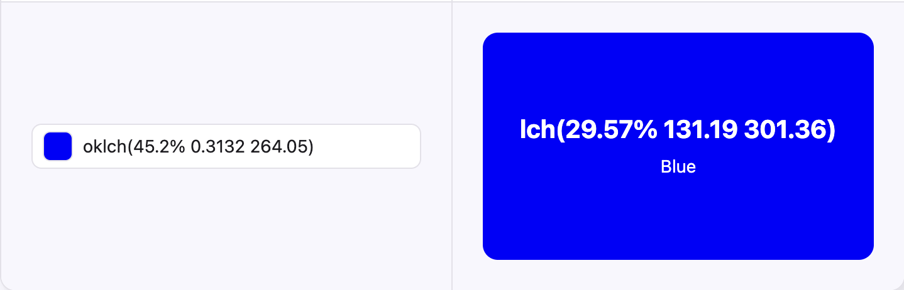
_oklch 파랑_

똑같이 명도 20%를 올려보겠다.
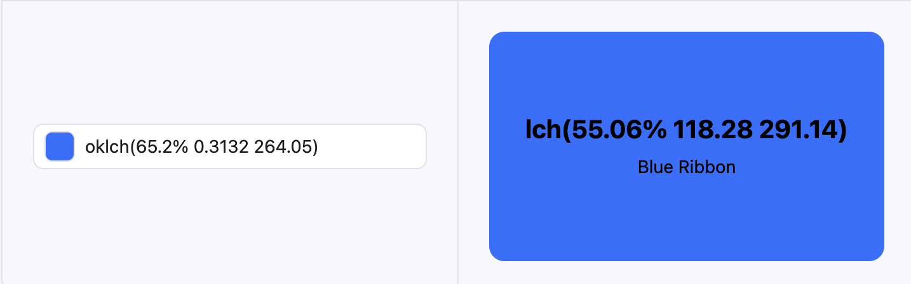
여전히 파란색 계열이며 밝아진 것을 확인할 수 있다.

이번엔 채도를 0.1 낮춰보겠다.

탁해졌고, 여전히 파란색임을 알 수 있다.

이렇게 Oklab, 그리고 LCH버전인 OKLCH는 앞선 문제들을 모두 해결한 완성된 색 공간이라고 볼 수 있으며 CSS Color Module Level 4의 표준으로 채택되었다.

```css
.red {
  color: oklch(62.8% 0.2577 29.23deg);
  /* = #FF0000 */
  /* 명도 62.8% 채도 0.2577 색상 29.23deg */
}
.green {
  color: oklch(86.64% 0.2948 142.5);
}
.blue {
  color: oklch(45.2% 0.3132 264.05);
}
.yellow {
  color: oklch(96.8% 0.211 109.77);
}
```

명도는 0에서 1까지(0%에서 100%까지)의 값을 가질 수 있다.
채도는 0에서 0.4까지의 값을 가질 수 있다.
색상은 각도로 360deg까지 가능하다.

사실 채도는 이론상 무한한 값을 가질 수 있지만 일반 모니터가 표현할 수 있는 색의 한계를 고려해 최대 0.4의 값을 가진다.

## Oklch가 주는 이점

이제 Oklch가 좋다는 것은 알았다. 그렇다면 실무적인 입장에서 왜 Oklch를 써야 할까? 다음은 여러분이 Oklch를 쓰도록 이해시켜 줄 Oklch의 장점들이다.

### 다크 모드 제작에 유리함

우리가 보통 다크 모드 테마를 제작할 땐 Primary Color의 명도를 높이고 채도를 살짝 낮춘다. (그래야 어두운 배경에 대비가 부드러워져 눈이 편하다)

`oklch`를 사용한다면 다크모드 제작이 훨씬 직관적으로 된다.

```css
.button-primary {
  color: oklch(59% 0.19 264);
  /* Primary Color (Blue) */
}

.dark .button-primary {
  color: oklch(75% 0.19 264);
  /* 다크모드에선 명도만 조금 높여주면 된다. */
}
```

### State색상 생성이 유리함

다크 모드와 비슷한 결이다. `hover`, `active`같은 상태를 지정할 때 일관된 방식을 적용할 수 있다.

```css
:root {
  --primary: oklch(59% 0.19 264);
}

.button {
  background-color: var(--primary);
}

.button:hover {
  /* hover시 명도 10% 올리기 */
  background-color: color-mix(in oklch, var(--primary) 90%, white 10%);
  /* 아래와 같은 방법도 가능하다 */
  background-color: oklch(from var(--primary) calc(l + 0.1) c h);
}

.button:active {
  /* active시 명도 10% 낮추기 */
  background-color: color-mix(in oklch, var(--primary) 90%, black 10%);
  /* or */
  background-color: oklch(from var(--primary) calc(l - 0.1) c h);
}
```

이 외에도 그라디언트가 더 자연스러워진다는 장점 등이 있지만 별로 와닿지는 않는 것 같아서 패스하겠다.

## 결론

이렇듯 `oklch`는 앞선 문제들을 모두 해결한 완성된 색 공간이라고 볼 수 있다.

원래의 질문으로 다시 돌아와 보자.

> 왜 oklch를 써야 하는가?

> 그것은 oklch가 RGB,HSL보다 인간에게 직관적이며, Lab,LCH보다 균일한 색 공간을 가지기 때문이다.

이 한마디를 하기 위해 긴 여정을 돌아왔다. 끝까지 읽어주셔서 감사하다.

## 참고

https://en.wikipedia.org/wiki/Oklab_color_space
https://evilmartians.com/chronicles/oklch-in-css-why-quit-rgb-hsl
https://developer.mozilla.org/en-US/blog/css-color-module-level-4/
https://en.wikipedia.org/wiki/HSL_and_HSV
https://developer.mozilla.org/en-US/docs/Web/CSS/color_value/oklab
https://evilmartians.com/chronicles/oklch-in-css-why-quit-rgb-hsl
